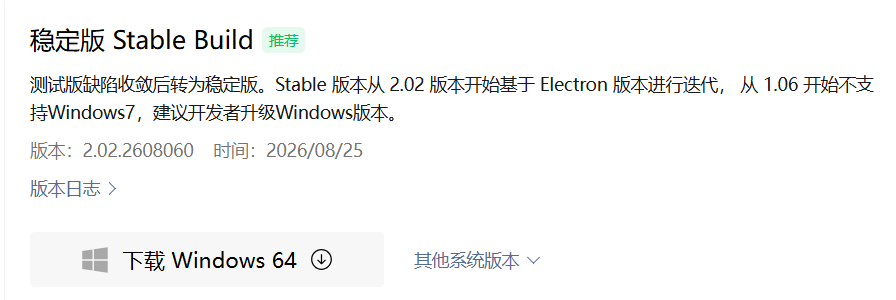
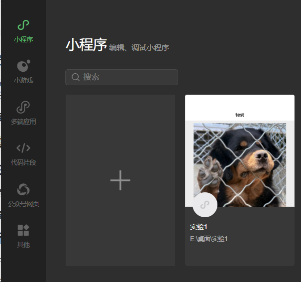
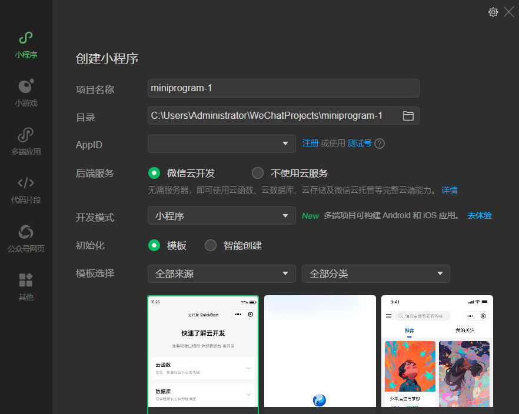
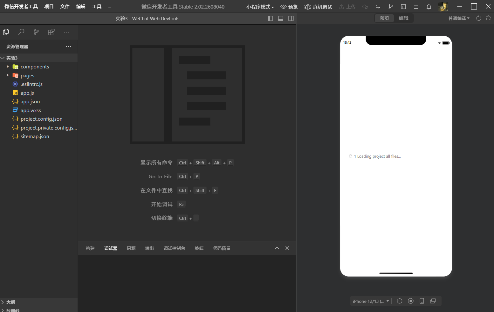
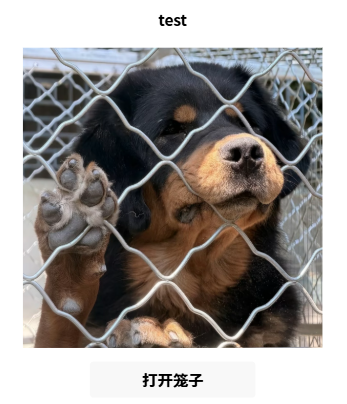
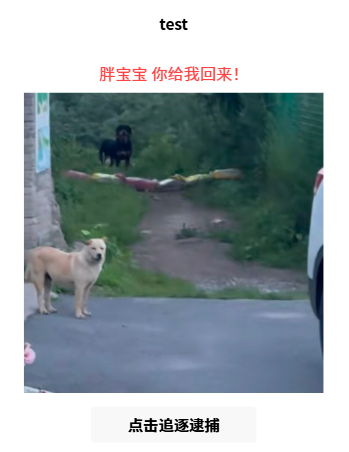

<center>姓名：沈卓娜  学号：24020007101</center>


| 姓名和学号？         | 沈卓娜，24020007101                                          |
| -------------------- | ------------------------------------------------------------ |
| 本实验属于哪门课程？ | 中国海洋大学26夏《移动软件开发》                             |
| 实验名称？           | 实验1：热身运动                                              |
| 博客地址？           | https://blog.csdn.net/natiedog/article/details/164065143?spm=1001.2014.3001.5501 |
| 代码仓库地址？       | https://github.com/shen5920/Mobile-Software-Development/tree/main |

## 一、实验内容

### 1.1 实验目的

1. 熟悉微信小程序官方开发者工具的下载与安装流程；
2. 学会创建一个空白的小程序项目，了解小程序的目录结构；
3. 通过实现一个 "Hello World" 小程序，动手编写代码，体会 WXML、WXSS、JS 三种文件各自的作用。

### 1.2 开发环境准备——下载与安装微信开发者工具

#### 1.2.1 下载微信开发者工具

微信小程序需要使用微信官方提供的「微信开发者工具」进行开发。下载地址为：

> https://developers.weixin.qq.com/miniprogram/dev/devtools/download.html

打开上述网址后，建议下载最新的**稳定版本（Stable Build）**，然后点击自己电脑对应系统的版本（Windows 64 位 / Windows 32 位 / macOS 等）下载即可。

> 

#### 1.2.2 安装微信开发者工具

安装非常方便，只需要双击安装包，然后不停地点击「下一步」即可完成安装。安装完成以后，打开官方开发者工具，界面长这样（首次打开需要用微信扫码登录）：

> 

### 1.3 创建属于自己的第一个小程序

#### 1.3.1 在桌面创建一个空白文件夹

在桌面创建一个空白文件夹，名字可以随便取，本实验以 lab1文件夹为例。

#### 1.3.2 新建并配置小程序项目

打开微信开发者工具，点击「+」号（或「新建项目」），选择「小程序」类型，开始配置小程序项目。

**注意：** 微信小程序官方最新的开发者工具界面有过多次变化，所以不同版本创建项目的界面可能略有不同，以下以最新版为例进行说明。

> 

在项目配置中，选择**「不使用模板」**（即从空白项目开始，不套用任何模板）。配置好以后点击「新建」，即可创建属于自己的第一个小程序。

> 

#### 1.3.3 小程序项目目录结构

创建完成后，本实验项目 `lab1` 的目录结构如下：

```
lab1/
├── app.js                 // 小程序入口逻辑文件
├── app.json               // 小程序全局配置文件
├── app.wxss               // 小程序全局样式文件
├── project.config.json    // 项目（工具）配置文件
├── sitemap.json           // 页面收录配置（SEO）
├── images/                // 图片资源目录
│   ├── 1.png
│   ├── 2.png
│   └── nailong.png
├── components/            // 自定义组件目录
│   └── navigation-bar/    // 自定义导航栏组件（默认生成）
└── pages/                 // 页面目录
    └── index/             // index 页面
        ├── index.js       // 页面逻辑
        ├── index.json     // 页面配置
        ├── index.wxml     // 页面结构
        └── index.wxss     // 页面样式
```

### 1.4 实现 Hello World 小程序

本实验的 Hello World 小程序参考官方视频教程：

> https://developers.weixin.qq.com/community/business/doc/0008ae90008ff80bd48838c5e5600d

其核心功能是：**点击按钮，改变页面里的文字**。在完成基础功能后，本实验对它做了一点扩展：点击按钮后不仅改变文字，还会切换页面上的图片，实现「打开笼子 → 追逐逮捕」的交互效果。

下面结合本实验的实际代码，分别介绍几个核心文件的作用。

#### 1.4.1 `app.json` —— 全局配置

```json
{
  "pages": [
    "pages/index/index"
  ],
  "window": {
    "navigationBarTextStyle": "black"
  },
  "style": "v2",
  "sitemapLocation": "sitemap.json",
  "lazyCodeLoading": "requiredComponents"
}
```

**解释：**
- `pages`：声明小程序所有页面的路径，数组第一项就是小程序的首页，这里只有一个 `pages/index/index` 页面；
- `window`：配置全局窗口样式，`navigationBarTextStyle` 设为 `"black"` 表示导航栏文字为黑色；
- `style: "v2"`：启用新版组件样式；
- `sitemapLocation`：指定页面收录配置文件的位置。

#### 1.4.2 `index.wxml` —— 页面结构

```xml
<!--index.wxml-->
<navigation-bar title="test" back="{{false}}" color="black" background="#FFF"></navigation-bar>
<scroll-view class="scrollarea" scroll-y type="list">
  <view class="container">
    <view wx:if="{{showTip}}" class="tip-text">胖宝宝 你给我回来！</view>
    <image mode="widthFix" src="{{imgSrc}}"></image>
    <button bindtap="handleBtnClick">{{btnText}}</button>
  </view>
</scroll-view>
```

**解释：**
- `<navigation-bar>`：自定义导航栏组件（项目默认生成）；
- `<scroll-view>`：可滚动区域，`scroll-y` 表示允许纵向滚动；
- `{{imgSrc}}`、`{{btnText}}`：**数据绑定**语法，用双大括号 `{{}}` 把 JS 里 `data` 中的数据渲染到页面上；
- `wx:if="{{showTip}}"`：**条件渲染**，只有当 `showTip` 为 `true` 时，提示文字才会显示；
- `bindtap="handleBtnClick"`：**事件绑定**，点击按钮时会触发 JS 中的 `handleBtnClick` 函数。

#### 1.4.3 `index.wxss` —— 页面样式

```css
.container{
  padding:20rpx;
  display:flex;
  flex-direction:column;
  align-items:center;
}
.tip-text{
  font-size:36rpx;
  color:#ff4444;
  margin:20rpx 0;
}
image{
  width:90%;
  margin-bottom:30rpx;
}
```

**解释：**
- `.container` 使用 `display: flex` 弹性布局，并配合 `flex-direction: column` 和 `align-items: center` 让内容**垂直排列并水平居中**；
- `rpx` 是小程序特有的**响应式长度单位**，它会根据屏幕宽度自动换算（750rpx = 屏幕宽度），保证在不同机型上显示效果一致；
- `image{ width:90% }` 设置图片宽度为父容器的 90%。

#### 1.4.4 `index.js` —— 页面逻辑

```js
Page({
  data: {
    status: 0,
    imgSrc: "/images/1.png",
    btnText: "打开笼子",
    showTip: false
  },
  handleBtnClick(){
    if(this.data.status === 0){
      this.setData({
        status:1,
        imgSrc:"/images/2.png",
        btnText:"点击追逐逮捕",
        showTip:true
      })
    }else{
      this.setData({
        status:0,
        imgSrc:"/images/1.png",
        btnText:"打开笼子",
        showTip:false
      })
    }
  }
})
```

**解释：**
- `Page({...})`：用于**注册一个页面**；
- `data`：页面的**初始数据**，包括状态标志 `status`、图片路径 `imgSrc`、按钮文字 `btnText`、提示显示标志 `showTip`；
- `handleBtnClick()`：按钮点击的处理函数。当 `status === 0` 时，通过 `this.setData({...})` 把图片切换成 `2.png`、按钮文字改为「点击追逐逮捕」、显示提示文字；否则恢复成初始状态，实现了**点击按钮切换页面内容和文字**的效果；
- `this.setData()` 是小程序**更新页面数据**的唯一方式，它会同步更新 `data` 并重新渲染页面。

#### 1.4.5 `index.json` —— 页面配置

```json
{
  "usingComponents": {
    "navigation-bar": "/components/navigation-bar/navigation-bar"
  }
}
```

**解释：** `usingComponents` 用于声明当前页面使用到的自定义组件，这里注册了默认生成的 `navigation-bar` 导航栏组件。

### 1.5 运行效果

点击开发者工具上方的「编译」按钮，即可在模拟器中预览小程序效果：

- **初始状态**：显示一张关在笼子里的图片，按钮文字为「打开笼子」；
- **点击按钮后**：图片切换为另一张图，按钮文字变为「点击追逐逮捕」，并显示提示文字「胖宝宝 你给我回来！」；
- **再次点击按钮**：恢复初始状态，如此反复切换。

> 

> 

### 1.6 WXML、WXSS、JS 三种文件的作用总结

| 文件类型 | 作用 | 类比 Web 前端 |
| -------- | ------------------------------------------ | ------------- |
| `.wxml`  | 定义页面的**结构**，负责"页面上有什么"       | HTML          |
| `.wxss`  | 定义页面的**样式**，负责"页面长什么样"       | CSS           |
| `.js`    | 定义页面的**逻辑和数据**，负责"页面怎么动"   | JavaScript    |

简单来说：**WXML 负责搭骨架，WXSS 负责美化外观，JS 负责交互逻辑**，三者共同构成一个小程序页面。

## 二、问题总结与体会

**遇到的问题及解决：**

1. **安装微信开发者工具时遇到的问题**：下载完安装包后，最开始双击启动安装包时，最先弹出报错提示「无法向 C 盘写入文件」。出现这个提示的根本原因是：当前以**普通权限**运行的安装程序，没有足够的操作系统权限，无法在 C 盘的系统目录中创建、修改文件，写入操作被 Windows 系统拦截，安装进程异常中断。这次中途失败的安装，直接破坏了本地的 `.exe` 安装文件，安装包数据因此受损；当之后再次双击同一个安装文件尝试运行时，就触发了第二份报错——「NSIS-Error 安装程序完整性校验失败」。

   针对这一个问题的完整解决流程如下：
   1. 将这份已经损坏的安装包以及相关临时缓存文件全部彻底删除，清除掉失败安装产生的所有残留文件；
   2. 前往官方渠道，重新下载一份全新、完整的安装程序；
   3. 不再直接双击打开，而是**右键新下载好的 exe 文件，选择「以管理员身份运行」**。管理员权限赋予了安装程序写入 C 盘的权限，不再出现写入失败，安装顺利完成，两个故障一并解决。

2. **点击按钮没有反应**：代码写好后，点击页面上的按钮却没有任何反应。一开始怀疑是代码写错了，于是询问 AI 寻求帮助，但检查后发现代码本身并没有问题，调试器也没有任何报错；按照 AI 提示做了一些改动后仍然无效。最后把整个微信开发者工具**完全关闭后重新启动**，再次点击按钮就正常了。这说明问题并不是代码逻辑错误，而是开发者工具的编译缓存或运行状态异常导致的，重启工具即可解决。

3. **图片路径问题**：一开始图片无法正常显示，排查后发现是图片路径写错了——当时没有仔细查看目录结构，只写了一个 `../`，导致路径层级不对、找不到图片。后来仔细核对了图片相对当前页面的位置，改成了正确的相对路径 `../../images/1.png` 之后才正常显示。以后引用图片时也可以直接改用**绝对路径**（以 `/` 开头，如 `/images/1.png`），就能避免这类由目录层级引起的路径错误。

6. **页面数据不更新**：修改了变量后页面没有变化，原因是直接给 `data` 赋值不会触发重新渲染，必须通过 `this.setData()` 来更新数据。

**收获与体会：**

通过本次实验，我完整地走了一遍小程序开发流程：从下载安装开发者工具、创建空白项目，到手写 WXML、WXSS、JS 代码实现交互效果。在安装环节，我还切身体会到了 Windows 系统中**文件权限与程序完整性校验**的重要性——普通权限无法向 C 盘系统目录写入，失败的中断安装还会损坏安装包数据，而「以管理员身份运行」正是解决这类权限问题的正确方式。在开发环节，最大的收获是真正理解了小程序三种核心文件的分工——WXML 负责结构、WXSS 负责样式、JS 负责逻辑，这种「结构-样式-逻辑」分离的思想与 Web 前端开发一脉相承。在把官方 Hello World 的"改文字"扩展成"改图片 + 改文字"的过程中，我也掌握了数据绑定 `{{}}`、条件渲染 `wx:if`、事件绑定 `bindtap` 以及 `setData` 更新视图等小程序的核心机制，为后续的移动软件开发打下了基础。
