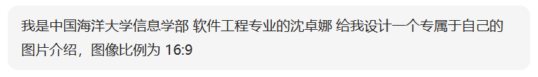
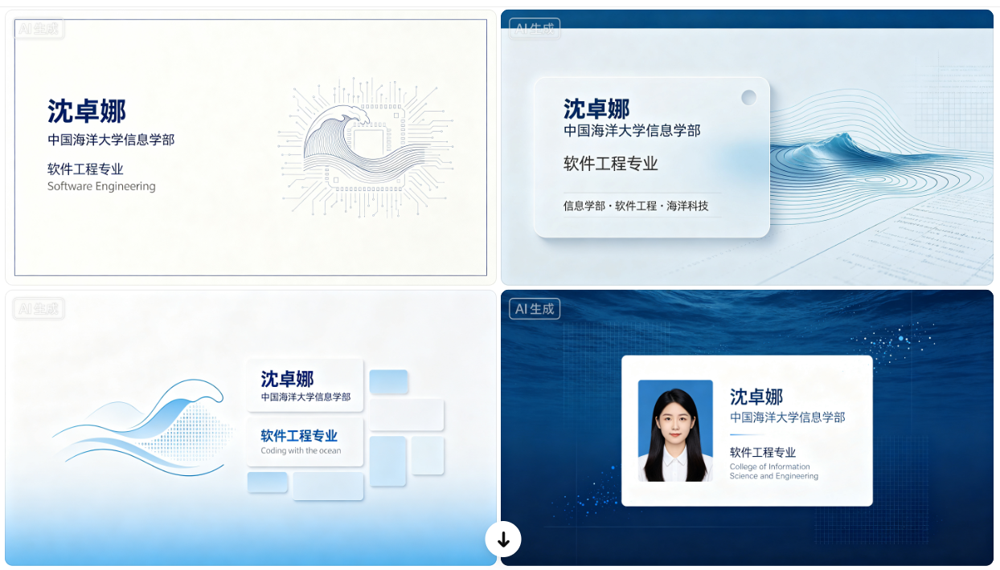
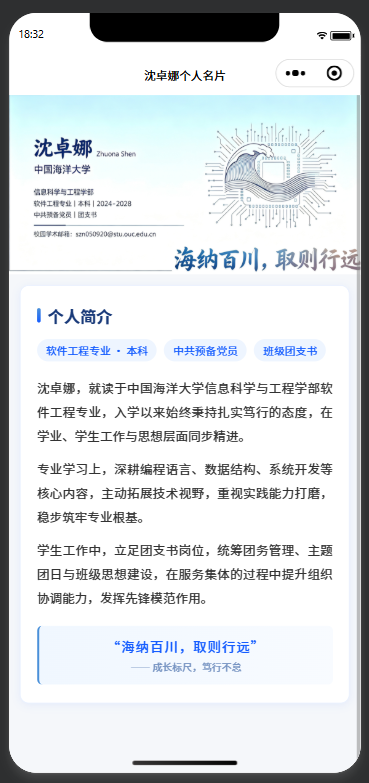

<center>姓名：沈卓娜  学号：24020007101</center>

| 姓名和学号？         | 沈卓娜，24020007101                                          |
| -------------------- | ------------------------------------------------------------ |
| 本实验属于哪门课程？ | 中国海洋大学26夏《移动软件开发》                             |
| 实验名称？           | 实验2：个人名片小程序                                        |
| 博客地址？           | [移动软件开发_实验2：个人名片小程序-CSDN博客](https://blog.csdn.net/natiedog/article/details/164095360?spm=1001.2014.3001.5502) |
| 代码仓库地址？       | https://github.com/shen5920/Mobile-Software-Development/tree/main |

## 一、实验内容

### 1.1 实验目的

1. 进一步熟悉小程序前端开发的基本流程；
2. 学会使用 AI 工具生成专属的个人名片头图（16:9）；
3. 制作一个属于自己的名片小程序，包含头图和文本描述。

### 1.2 使用 AI 生成个人名片头图

推荐使用 AI 工具生成专属于自己的名片头图（16:9 横版），可以在提示词中添加自己的特点描述。本实验使用「豆包」AI 工具进行生成。

在豆包中输入的提示词大意如下：

> 我是中国海洋大学信息学部 软件工程专业的沈卓娜 给我设计一个专属于自己的图片介绍，图像比例为 16:9。
>
> 后续又根据ai的建议提供了一些个人信息丰富图片内容

> 
>
> 

### 1.3 制作个人名片小程序

参考官方视频教程，按照步骤完成自己的小程序：

> https://developers.weixin.qq.com/community/business/doc/000c869e5c46586bd688cd6175fc0d

小程序页面的整体结构为：**上半部分是 AI 生成的名片头图，下半部分是自定义的个人介绍内容**。

本实验项目的目录结构如下：

```
实验2/
├── app.js                 // 小程序入口逻辑文件
├── app.json               // 小程序全局配置文件
├── app.wxss               // 小程序全局样式文件
├── project.config.json    // 项目（工具）配置文件
├── sitemap.json           // 页面收录配置
├── img/
│   └── szn.png            // AI 生成的名片头图（16:9）
└── pages/
    └── index/
        ├── index.js       // 页面逻辑
        ├── index.json     // 页面配置
        ├── index.wxml     // 页面结构
        └── index.wxss     // 页面样式
```

### 1.4 代码实现与解释

#### 1.4.1 `app.json` —— 全局配置（设置导航栏标题）

```json
{
  "pages": [
    "pages/index/index"
  ],
  "window": {
    "backgroundTextStyle": "light",
    "navigationBarBackgroundColor": "#fff",
    "navigationBarTextStyle": "black",
    "navigationBarTitleText": "沈卓娜个人名片"
  },
  "style": "v2",
  "sitemapLocation": "sitemap.json",
  "lazyCodeLoading": "requiredComponents"
}
```

**解释：**
- `pages`：声明小程序所有页面，数组第一项 `pages/index/index` 为首页；
- `navigationBarTitleText`：设置导航栏标题为「沈卓娜个人名片」；
- `navigationBarBackgroundColor` 与 `navigationBarTextStyle`：设置导航栏背景为白色、文字为黑色。

#### 1.4.2 `index.wxml` —— 页面结构

```xml
<!--index.wxml-->
<scroll-view class="scrollarea" scroll-y>
  <view class="co-ntainer">
    <image mode="widthFix" src="/img/szn.png"></image>

    <view class="intro-card">
      <view class="card-title">
        <view class="title-bar"></view>
        <text>个人简介</text>
      </view>

      <view class="tag-group">
        <view class="tag">软件工程专业 · 本科</view>
        <view class="tag">中共预备党员</view>
        <view class="tag">班级团支书</view>
      </view>

      <view class="intro-text">
        沈卓娜，就读于中国海洋大学信息科学与工程学部软件工程专业，入学以来始终秉持扎实笃行的态度，在学业、学生工作与思想层面同步精进。
      </view>
      <view class="intro-text">
        专业学习上，深耕编程语言、数据结构、系统开发等核心内容，主动拓展技术视野，重视实践能力打磨，稳步筑牢专业根基。
      </view>
      <view class="intro-text">
        学生工作中，立足团支书岗位，统筹团务管理、主题团日与班级思想建设，在服务集体的过程中提升组织协调能力，发挥先锋模范作用。
      </view>

      <view class="motto">
        <text class="motto-text">“海纳百川，取则行远”</text>
        <text class="motto-desc">—— 成长标尺，笃行不怠</text>
      </view>
    </view>

  </view>
</scroll-view>
```

**解释：**
- `<scroll-view scroll-y>`：可纵向滚动的容器，方便在手机上滑动查看完整名片；
- `<image mode="widthFix" src="/img/szn.png">`：上半部分显示 AI 生成的名片头图，`mode="widthFix"` 表示宽度固定、高度按比例自适应，保证 16:9 头图不变形；
- `.intro-card`：下半部分的个人简介卡片，包含：
  - `.card-title` + `.title-bar`：带竖条装饰的「个人简介」标题；
  - `.tag-group` / `.tag`：三个身份标签（专业、政治面貌、职务）；
  - `.intro-text`：三段个人介绍文字；
  - `.motto`：座右铭「海纳百川，取则行远」。

#### 1.4.3 `index.wxss` —— 页面样式

```css
/**index.wxss**/
page {
  height: 100vh;
  display: flex;
  flex-direction: column;
  margin: 0;
  padding: 0;
  background-color: #f5f7fa;
}

.scrollarea {
  flex: 1;
  width: 100%;
}

image {
  width: 100%;
  display: block;
}

.intro-card {
  margin: 24rpx 24rpx;
  padding: 40rpx 36rpx;
  background: #ffffff;
  border-radius: 20rpx;
  box-shadow: 0 4rpx 20rpx rgba(22, 93, 255, 0.08);
  border: 1rpx solid #e8f0ff;
}

.card-title {
  display: flex;
  align-items: center;
  font-size: 36rpx;
  font-weight: 600;
  color: #1a3b7a;
  margin-bottom: 28rpx;
}

.title-bar {
  width: 8rpx;
  height: 32rpx;
  background: linear-gradient(180deg, #4a90d9, #165dff);
  border-radius: 4rpx;
  margin-right: 16rpx;
}

.tag-group {
  display: flex;
  flex-wrap: wrap;
  gap: 16rpx;
  margin-bottom: 32rpx;
}

.tag {
  padding: 8rpx 20rpx;
  background: #eef5ff;
  color: #165dff;
  font-size: 24rpx;
  border-radius: 30rpx;
}

.intro-text {
  font-size: 28rpx;
  line-height: 1.9;
  color: #333;
  margin-bottom: 20rpx;
  text-align: justify;
}

.motto {
  margin-top: 36rpx;
  padding: 24rpx;
  background: linear-gradient(90deg, #f0f7ff, #f8fbff);
  border-radius: 12rpx;
  text-align: center;
  border-left: 6rpx solid #4a90d9;
}

.motto-text {
  display: block;
  font-size: 30rpx;
  font-weight: 500;
  color: #165dff;
  letter-spacing: 2rpx;
}

.motto-desc {
  display: block;
  font-size: 22rpx;
  color: #7794c2;
  margin-top: 8rpx;
}
```

**解释：**
- `page`：设置页面整体高度为 100vh、浅灰背景色 `#f5f7fa`，作为名片内容的底色；
- `image { width:100% }`：让头图占满整行宽度；
- `.intro-card`：白色圆角卡片，配合 `box-shadow` 阴影和 `border` 边框，形成悬浮的卡片效果；
- `.title-bar`：用 `linear-gradient` 渐变做出标题左侧的蓝色竖条装饰；
- `.tag`：圆角胶囊形标签，浅蓝底 + 深蓝字，用于突出身份信息；
- `.motto`：座右铭区域，浅蓝渐变背景 + 左侧蓝色描边，居中显示；
- 整体配色以蓝色（`#165dff`、`#4a90d9`）为主，与头图风格保持统一。

### 1.5 运行效果

编译运行后，小程序顶部导航栏显示「沈卓娜个人名片」，页面整体分为上下两部分：

- **上半部分**：AI 生成的 16:9 个人名片头图；
- **下半部分**：个人简介卡片，包含「个人简介」标题、三个身份标签、三段介绍文字以及校训等

> 

## 二、问题总结与体会

**遇到的问题及解决：**

1. **渲染引擎配置错误（运行时报错）**：控制台报错 `create skylineWindow 12 failed Unexpected native error`（原生错误），页面无法正常渲染启动。分析原因：`app.json` 中默认开启了 Skyline 新一代渲染引擎（`"renderer": "skyline"`）以及配套的 glass-easel 组件框架，而 Windows 端的开发者工具对 Skyline 的兼容性较差，同时页面中的自定义导航栏标签与 Skyline 渲染模式不兼容，最终触发了窗口创建失败。解决方法：移除所有 Skyline 专属配置项，恢复小程序默认的 WebView 渲染模式，报错随即消失、页面恢复正常渲染。

2. **WXML 代码语法与结构错误**：
   - **类名拼写错误**：标题的字号、加粗样式完全不生效。排查发现是 `<view clas="title">` 中的 `class` 拼写漏写了字母 `s`，导致 CSS 选择器无法匹配到对应元素，样式自然失效。
   - **标签嵌套不闭合**：页面结构错乱、滚动区域行为异常。排查发现是 `container` 和 `body` 两层 view 容器只闭合了一层，导致 DOM 结构不完整。

**收获与体会：**

通过本次实验，我完成了一个专属于自己的名片小程序。相比实验1，本次实验让我进一步体会到：一个小程序页面同样遵循「结构（WXML）— 样式（WXSS）— 逻辑（JS）」的分工，而 WXSS 中的 `rpx` 响应式单位、`flex` 弹性布局、圆角阴影等 CSS 技巧，配合 AI 生成的头图，就能做出视觉上颇为精致的个人名片。在调试过程中，我还积累了排查页面问题的经验：遇到报错先看控制台的错误信息（如 Skyline 渲染引擎报错）；样式不生效时检查类名是否拼写正确、标签是否闭合；页面出现莫名空白时则逐段检查 margin、padding 等样式属性。这些排查思路对后续开发很有帮助。
