<center>姓名：沈卓娜  学号：24020007101</center>

| 姓名和学号？         | 沈卓娜，24020007101                                          |
| -------------------- | ------------------------------------------------------------ |
| 本实验属于哪门课程？ | 中国海洋大学26夏《移动软件开发》                             |
| 实验名称？           | 实验3：高校新闻网                                            |
| 博客地址？           | [移动软件开发_实验3：高校新闻网-CSDN博客](https://blog.csdn.net/natiedog/article/details/164222749?spm=1001.2014.3001.5502) |
| 代码仓库地址？       | https://github.com/shen5920/Mobile-Software-Development/tree/main |

## 一、实验内容

### 1.1 实验目的

1. 综合所学的小程序基础知识与各类 API，从零开始创建一个完整的新闻小程序前端项目；
2. 模仿中国海洋大学新闻网，实现一个基于模拟数据的简易高校新闻小程序，包含首页、新闻详情页、个人中心页三个页面，并支持新闻分类、搜索、排序、时间筛选、点赞、收藏、登录等完整功能；
3. 掌握 tabBar 页面切换、`swiper` 轮播、`wx.navigateTo` 页面跳转、本地缓存 `wx.getStorageSync` / `wx.setStorageSync`、头像昵称填写能力（`open-type="chooseAvatar"` + `input type="nickname"`）、`wx.getFileSystemManager().saveFile` 等 API 的实际用法；
4. 在开发过程中熟练掌握真机预览、调试，并解决小程序主包 2MB 体积限制等问题。

### 1.2 项目创建与目录结构

新建项目，选择空白文件夹，创建小程序，选择「不使用云服务」，模板选择「JS 基础」。

在 `app.json` 的 `pages` 属性下添加 `pages/detail/detail` 和 `pages/my/my`，保存后 `pages` 文件夹下自动生成 detail 页面和 my 页面。新闻图片放入 `images/news/` 目录（50 张），并新建 `utils/store.js` 统一封装收藏、点赞、用户信息的本地缓存读写。

最终项目目录结构如下：

```
实验3/
├── app.js                 // 小程序入口逻辑文件（globalData 登录状态 + onLaunch 恢复）
├── app.json               // 小程序全局配置（页面、导航栏、tabBar）
├── app.wxss               // 小程序全局样式（新闻列表卡片、点赞按钮样式）
├── project.config.json    // 项目（工具）配置文件
├── sitemap.json           // 页面收录配置
├── prepare_preview.ps1    // 图片压缩脚本（解决主包 2MB 体积超限）
├── images/                // 图片资源
│   ├── index.png          // tabBar「首页」未选中图标
│   ├── index_blue.png     // tabBar「首页」选中图标
│   ├── my.png             // tabBar「我的」未选中图标
│   ├── my_blue.png        // tabBar「我的」选中图标
│   └── news/              // 新闻图片（24 条新闻，共 50 张，已压缩）
├── utils/
│   ├── common.js          // 24 条模拟新闻数据 + 分类/搜索/轮播/详情等工具函数
│   └── store.js           // 收藏、点赞、用户信息的本地缓存封装
└── pages/                 // 页面目录
    ├── index/             // 首页（搜索 + 轮播 + 分类 + 排序 + 时间筛选 + 列表点赞）
    ├── detail/            // 新闻详情页（图文混排 + 收藏 + 点赞）
    └── my/                // 个人中心页（登录弹框 + 收藏/点赞标签 + 左滑删除）
```

### 1.3 视图设计

#### 1.3.1 导航栏设计

在 `app.json` 中修改 `window` 属性配置导航栏效果，修改导航栏颜色、标题以及标题颜色：

```json
"window": {
  "navigationBarBackgroundColor": "#328EEB",
  "navigationBarTitleText": "我的新闻网",
  "navigationBarTextStyle": "white"
}
```

**解释：** `navigationBarBackgroundColor` 设置导航栏背景为蓝色 `#328EEB`，`navigationBarTitleText` 设置标题为「我的新闻网」，`navigationBarTextStyle` 设置标题文字为白色。

#### 1.3.2 tabBar 设计

在 `app.json` 中启用 tabBar，引用 `images` 文件夹中的图片素材，让「首页」和「我的」两个图标可以点击切换，同时切换图标颜色：

```json
"tabBar": {
  "color": "#000000",
  "selectedColor": "#328EEB",
  "list": [
    { "pagePath": "pages/index/index", "text": "首页", "iconPath": "images/index.png", "selectedIconPath": "images/index_blue.png" },
    { "pagePath": "pages/my/my", "text": "我的", "iconPath": "images/my.png", "selectedIconPath": "images/my_blue.png" }
  ]
}
```

**解释：** `color` 为未选中文字颜色（黑色），`selectedColor` 为选中文字颜色（蓝色）；每个 `list` 项通过 `pagePath` 指定对应页面，`iconPath` / `selectedIconPath` 分别指定未选中和选中时的图标。注意首页和个人中心页是 tabBar 页面，而新闻详情页是通过 `wx.navigateTo` 跳转打开的普通页面，不在 tabBar 中。

#### 1.3.3 首页设计

首页包含五部分：搜索栏、幻灯片滚动（`<swiper>`）、分类标签栏、排序/筛选栏、新闻列表。

```xml
<!-- 搜索栏 -->
<view class="search-bar">
  <view class="search-box">
    <input class="search-input" placeholder="搜索新闻标题" value="{{searchKeyword}}" bindinput="onSearchInput" confirm-type="search" />
  </view>
</view>
<!-- 幻灯片滚动（搜索时隐藏） -->
<swiper wx:if="{{!searching}}" indicator-dots="true" autoplay="true" interval="5000" duration="500" circular="true">
  <block wx:for="{{swiperImg}}" wx:key="id">
    <swiper-item bindtap="goToDetailFromSwiper" data-id="{{item.id}}">
      <image src="{{item.src}}" mode="aspectFill"></image>
      <view class="swiper-title">{{item.title}}</view>
    </swiper-item>
  </block>
</swiper>
<!-- 分类标签栏 -->
<view class="category-tabs" wx:if="{{!searching}}">
  <view wx:for="{{categories}}" wx:key="*this"
        class="tab-item {{currentCategory === item ? 'tab-item--active' : ''}}"
        bindtap="switchCategory" data-category="{{item}}">{{item}}</view>
</view>
<!-- 排序栏 + 筛选按钮 -->
<view class="sort-bar">
  <text class="sort-label">排序：</text>
  <view wx:for="{{sortOptions}}" wx:key="key"
        class="sort-item {{sortType === item.key ? 'sort-item--active' : ''}}"
        bindtap="changeSort" data-sort="{{item.key}}">{{item.label}}</view>
  <view class="filter-btn {{timeFilter !== 'all' ? 'filter-btn--active' : ''}}" bindtap="toggleFilterPanel">{{filterLabel}} ▼</view>
</view>
<!-- 时间筛选面板 -->
<view class="filter-panel" wx:if="{{showFilter}}">
  <view class="filter-options">
    <view class="filter-option {{timeFilter === 'all' ? 'filter-option--active' : ''}}" bindtap="setTimeFilter" data-filter="all">全部</view>
    <view class="filter-option {{timeFilter === 'today' ? 'filter-option--active' : ''}}" bindtap="setTimeFilter" data-filter="today">今日</view>
    <view class="filter-option {{timeFilter === 'week' ? 'filter-option--active' : ''}}" bindtap="setTimeFilter" data-filter="week">本周</view>
    <view class="filter-option {{timeFilter === 'month' ? 'filter-option--active' : ''}}" bindtap="setTimeFilter" data-filter="month">本月</view>
  </view>
  <picker mode="date" value="{{pickerDate}}" bindchange="onDateChange">
    <view class="filter-date-item">按日期选择（选具体某天）</view>
  </picker>
</view>
<!-- 新闻列表（左文字右图片，带点赞按钮） -->
<view class="news-list">
  <view class="news-item" wx:for="{{newsList}}" wx:key="{{item.id}}" bindtap="goToDetail" data-id="{{item.id}}">
    <view class="news-info">
      <text class="news-title">{{item.title}}</text>
      <view class="news-bottom">
        <text class="news-date">{{item.add_date}}</text>
        <view class="like-btn {{item.liked ? 'like-btn--active' : ''}}" catchtap="toggleLike" data-id="{{item.id}}">{{item.liked ? '已赞' : '赞'}}</view>
      </view>
    </view>
    <image wx:if="{{item.poster}}" src="{{item.poster}}" mode="aspectFill"></image>
  </view>
  <view wx:if="{{newsList.length === 0}}" class="empty-tip">暂无相关新闻</view>
</view>
```

**解释：**
- 搜索栏的 `<input>` 绑定 `bindinput="onSearchInput"`，输入即实时搜索；搜索时通过 `wx:if="{{!searching}}"` 隐藏轮播图和分类栏，只显示搜索结果；
- `<swiper>` 轮播图的素材 `swiperImg` 由当前分类下有图新闻动态生成，每条轮播图附带半透明标题条，点击可跳转对应详情；
- 分类标签栏通过 `wx:for="{{categories}}"` 遍历 4 个分类，点击切换分类并联动轮播图和列表；
- 排序栏提供「最新优先 / 最早优先 / 默认顺序」三种排序，右侧「筛选」按钮展开时间筛选面板（今日 / 本周 / 本月 + 按日期选择日历）；
- 列表项采用「左文字右图片」布局，无图新闻不渲染图片（`wx:if="{{item.poster}}"`），右侧留白；每条的点赞按钮用 `catchtap` 阻止冒泡，避免触发整卡跳转。

#### 1.3.4 个人中心页设计

个人中心页包含登录头部、收藏/点赞双标签列表、登录弹框三部分：

```xml
<!-- 头部登录区 -->
<view class="myLogin">
  <block wx:if="{{isLogin}}">
    <image wx:if="{{src}}" class="avatar" src="{{src}}"></image>
    <view wx:else class="avatar avatar--placeholder"></view>
    <text class="nickname">{{nickName}}</text>
    <button class="logout-btn" bindtap="logout">退出登录</button>
  </block>
  <block wx:else>
    <view class="avatar avatar--placeholder"></view>
    <button class="login-btn" bindtap="openLoginModal">未登录，点此登录</button>
  </block>
</view>
<!-- 收藏/点赞标签 -->
<view class="list-tabs">
  <view class="list-tab {{currentTab === 'favorite' ? 'list-tab--active' : ''}}" bindtap="switchTab" data-tab="favorite">我的收藏（{{favoriteNum}}）</view>
  <view class="list-tab {{currentTab === 'like' ? 'list-tab--active' : ''}}" bindtap="switchTab" data-tab="like">我的点赞（{{likeNum}}）</view>
</view>
<!-- 收藏列表（左滑取消） -->
<view wx:if="{{currentTab === 'favorite'}}" class="news-list">
  <view class="swipe-item" wx:for="{{favorites}}" wx:key="id"
        data-tab="favorites" data-index="{{index}}"
        bindtouchstart="touchStart" bindtouchmove="touchMove" bindtouchend="touchEnd">
    <view class="swipe-delete" catchtap="cancelFavorite" data-id="{{item.id}}">取消收藏</view>
    <view class="news-item swipe-content" style="transform: translateX({{item.offsetX}}px);" bindtap="goToDetail" data-tab="favorites" data-index="{{index}}" data-id="{{item.id}}">
      <view class="news-info">
        <text class="news-title">{{item.title}}</text>
        <text class="news-date">{{item.add_date}}</text>
      </view>
      <image wx:if="{{item.poster}}" src="{{item.poster}}" mode="aspectFill"></image>
    </view>
  </view>
  <view class="empty" wx:if="{{favoriteNum == 0}}">暂无收藏内容</view>
</view>
<!-- 点赞列表（结构同收藏列表，略） -->
<!-- 登录弹框（头像昵称填写） -->
<view class="modal-mask" wx:if="{{showLoginModal}}" bindtap="closeLoginModal">
  <view class="modal" catchtap="noop">
    <view class="modal-title">使用微信头像和昵称</view>
    <view class="modal-desc">点击头像选择微信头像，点击昵称框填写昵称</view>
    <view class="avatar-wrapper">
      <image wx:if="{{avatarUrl}}" class="avatar-preview" src="{{avatarUrl}}" mode="aspectFill"></image>
      <view wx:else class="avatar-preview avatar-preview--empty">选择头像</view>
      <button class="avatar-picker" open-type="chooseAvatar" bindchooseavatar="onChooseAvatar"></button>
    </view>
    <input class="nickname-input" type="nickname" placeholder="请输入昵称" value="{{inputNickName}}" bindinput="onInputNickName" />
    <view class="modal-btns">
      <button class="modal-btn modal-btn--cancel" bindtap="closeLoginModal">取消</button>
      <button class="modal-btn modal-btn--confirm" bindtap="confirmLogin">允许</button>
    </view>
  </view>
</view>
```

**解释：**
- 头部通过 `wx:if="{{isLogin}}"` 判断登录状态：已登录显示头像、昵称和「退出登录」按钮，未登录显示「未登录，点此登录」；
- 收藏和点赞用两个标签 `list-tab` 切换展示，各自带数量；
- 每条列表项用 `swipe-item`（外层，`overflow:hidden`）包裹，内层 `swipe-delete` 是藏在右侧的红色删除按钮，`swipe-content` 通过 `transform: translateX` 左右滑动；向左滑露出「取消收藏 / 取消点赞」按钮；
- 登录弹框使用头像昵称填写能力：`open-type="chooseAvatar"` 按钮选择微信头像，`input type="nickname"` 自动带出微信昵称。其中「视觉圆形」用 `avatar-wrapper` + `avatar-preview`（`view`/`image`，尺寸可控）实现，`avatar-picker` 是一个透明 `button` 覆盖在上面，只负责点击触发选头像，避免 `button` 默认样式导致头像框变形。

#### 1.3.5 新闻页设计

新闻页用于显示文章详细信息，并提供收藏和点赞功能。由于新闻正文中需要穿插多张图片，`article.content` 采用了**图文混排块数组**结构（`{type:'text', text}` 或 `{type:'image', src, desc}`）：

```xml
<view class="container">
  <view class="title">{{article.title}}</view>
  <view class="meta">作者：{{article.author}}　来源：{{article.source}}　发布时间：{{article.add_date}}</view>
  <view class="poster" wx:if="{{article.poster}}">
    <image src="{{article.poster}}" mode="widthFix"></image>
  </view>
  <view class="content">
    <block wx:for="{{article.content}}">
      <view wx:if="{{item.type === 'text'}}" class="para">{{item.text}}</view>
      <view wx:elif="{{item.type === 'image'}}" class="pic">
        <image src="{{item.src}}" mode="widthFix"></image>
        <text wx:if="{{item.desc}}" class="pic-desc">{{item.desc}}</text>
      </view>
    </block>
  </view>
  <view class="wen-tu">{{article.wenTu}}</view>
  <view class="editor">{{article.editor}}</view>
  <view class="resp-editor">{{article.respEditor}}</view>
  <view class="action-bar">
    <button class="fav-btn {{isAdd ? 'fav-btn--active' : ''}}" bindtap="toggleFavorites">{{isAdd ? '已收藏' : '收藏'}}</button>
    <button class="fav-btn {{isLike ? 'fav-btn--active' : ''}}" bindtap="toggleLike">{{isLike ? '已点赞' : '点赞'}}</button>
  </view>
</view>
```

**解释：**
- 标题、作者/来源/发布时间、海报图、正文依次展示；正文通过 `wx:for` 遍历 `article.content`，`text` 块渲染为段落，`image` 块渲染为图片并附带图注；
- 无图新闻通过 `wx:if="{{article.poster}}"` 不渲染海报图；
- 正文后依次展示「文/图」「编辑」「责任编辑」三条署名信息；
- 底部 `action-bar` 内并排「收藏」和「点赞」两个按钮，分别通过 `isAdd` / `isLike` 动态切换「已收藏/收藏」「已点赞/点赞」状态。

### 1.4 逻辑实现

#### 1.4.1 `utils/common.js` —— 模拟新闻数据与查询函数

```js
const categories = ['海大要闻', '综合新闻', '媒体海大', '学术海大'];

const news = [
  {
    id: '1',
    category: '海大要闻',
    title: '山东省人民政府副省长、党组成员闫剑波来校调研',
    author: '袁艺',
    source: '新闻中心',
    add_date: '2026-08-28',
    poster: '/images/news/1.jpg',
    content: [
      { type: 'text', text: '本站讯 8月27日，……' },
      { type: 'image', src: '/images/news/3.2.jpg', desc: '图注……' }
    ],
    wenTu: '文/图：袁艺',
    editor: '编辑：赵奚赟',
    respEditor: '责任编辑：李华昌'
  },
  // …… 共 24 条新闻（海大要闻 / 综合新闻 / 媒体海大 / 学术海大 各 6 条）
];

function getCategories() { return categories; }

// 获取新闻列表（可传入分类名筛选）
function getNewsList(category) {
  let list = [];
  for (var i = 0; i < news.length; i++) {
    if (category && news[i].category != category) continue;
    list.push({ id: news[i].id, poster: news[i].poster, add_date: news[i].add_date, title: news[i].title, category: news[i].category });
  }
  return list;
}

// 获取轮播图列表（只返回有图新闻）
function getSwiperList(category) {
  let list = [];
  for (var i = 0; i < news.length; i++) {
    if (category && news[i].category != category) continue;
    if (!news[i].poster) continue; // 无图新闻不进轮播
    list.push({ id: news[i].id, src: news[i].poster, title: news[i].title });
  }
  return list;
}

// 按标题关键词跨分类搜索
function searchNews(keyword) {
  let list = [];
  for (var i = 0; i < news.length; i++) {
    if (news[i].title.indexOf(keyword) >= 0) {
      list.push({ id: news[i].id, poster: news[i].poster, add_date: news[i].add_date, title: news[i].title, category: news[i].category });
    }
  }
  return list;
}

function getNewsDetail(newsID) {
  let msg = { code: '404', news: {} };
  for (var i = 0; i < news.length; i++) {
    if (newsID == news[i].id) { msg.code = '200'; msg.news = news[i]; break; }
  }
  return msg;
}

module.exports = { getNewsList, getSwiperList, searchNews, getNewsDetail, getCategories };
```

**解释：** `news` 数组存放 24 条分类新闻，每条含分类、标题、作者、来源、日期、海报图、图文混排正文和署名信息；`getCategories` 返回分类数组；`getNewsList` / `getSwiperList` 支持按分类筛选（`getSwiperList` 额外过滤掉无图新闻）；`searchNews` 按标题关键词跨分类搜索；`getNewsDetail` 按 id 返回完整新闻对象。

#### 1.4.2 `utils/store.js` —— 收藏/点赞/用户信息缓存封装

为了统一管理收藏、点赞、用户信息，将原本「一条新闻一个 key」的散乱存储改为**数组存储**，并封装成独立模块：

```js
const FAV_KEY = 'favorites';
const LIKE_KEY = 'likes';
const USER_KEY = 'userInfo';

function getFavorites() { return wx.getStorageSync(FAV_KEY) || []; }
function getLikes() { return wx.getStorageSync(LIKE_KEY) || []; }

function isFavorite(id) {
  let list = getFavorites();
  for (let i = 0; i < list.length; i++) { if (list[i].id === id) return true; }
  return false;
}
// isLiked 同理

function addFavorite(article) {
  let list = getFavorites();
  for (let i = 0; i < list.length; i++) { if (list[i].id === article.id) return; }
  list.push(article);
  wx.setStorageSync(FAV_KEY, list);
}
function removeFavorite(id) {
  wx.setStorageSync(FAV_KEY, getFavorites().filter(a => a.id !== id));
}
// addLike / removeLike 同理

function getUserInfo() { return wx.getStorageSync(USER_KEY) || null; }
function setUserInfo(info) { wx.setStorageSync(USER_KEY, info); }
function clearUserInfo() { wx.removeStorageSync(USER_KEY); }

module.exports = { getFavorites, isFavorite, addFavorite, removeFavorite, getLikes, isLiked, addLike, removeLike, getUserInfo, setUserInfo, clearUserInfo };
```

**解释：** 收藏和点赞分别用 `favorites`、`likes` 两个数组缓存（避免与其它缓存混淆），用户信息单独存 `userInfo`；所有读写都收敛到这个模块，详情页、首页、个人中心页统一调用，避免各页面重复实现、逻辑不一致。

#### 1.4.3 首页逻辑（分类 + 搜索 + 排序 + 时间筛选 + 点赞）

```js
// 排序
sortList: function (list, sortType) {
  let sorted = list.slice();
  if (sortType === 'time-desc') {
    sorted.sort((a, b) => a.add_date < b.add_date ? 1 : -1);
  } else if (sortType === 'time-asc') {
    sorted.sort((a, b) => a.add_date > b.add_date ? 1 : -1);
  }
  return sorted; // 'default' 保持原始顺序
},

// 按时间筛选（今日/本周/本月/具体日期）
filterByTime: function (list, filter) {
  if (!filter || filter === 'all') return list;
  let todayStr = this.formatDate(new Date());
  if (filter === 'today') return list.filter(n => n.add_date === todayStr);
  if (filter === 'week') {
    let range = this.getWeekRange(new Date()); // 计算本周一~周日
    return list.filter(n => n.add_date >= range.start && n.add_date <= range.end);
  }
  if (filter === 'month') {
    let ym = todayStr.slice(0, 7); // 当前 YYYY-MM
    return list.filter(n => n.add_date.indexOf(ym) === 0);
  }
  return list.filter(n => n.add_date === filter); // 具体日期
},

// 渲染：先筛选 → 再排序 → 再标注点赞状态
renderNewsList: function () {
  let list = this.filterByTime(this._baseList, this.data.timeFilter);
  list = this.annotateLikes(this.sortList(list, this.data.sortType));
  this.setData({ newsList: list });
},

// 列表点赞/取消点赞
toggleLike: function (e) {
  if (!getApp().globalData.isLogin) { /* 弹「请先登录」并跳转 */ return; }
  let id = e.currentTarget.dataset.id;
  // 从当前列表找到该条新闻
  if (store.isLiked(id)) store.removeLike(id);
  else store.addLike({ id: item.id, poster: item.poster, add_date: item.add_date, title: item.title, category: item.category });
  this.renderNewsList();
},

onLoad: function () {
  this._baseList = common.getNewsList(this.data.currentCategory);
  this.setData({
    categories: common.getCategories(),
    swiperImg: common.getSwiperList(this.data.currentCategory),
    pickerDate: this.formatDate(new Date())
  });
  this.renderNewsList();
}
```

**解释：**
- 用 `_baseList` 保存「未筛选的原始列表」（来自当前分类或搜索结果），`renderNewsList` 统一执行「时间筛选 → 排序 → 标注点赞状态」三步，再更新视图，避免逻辑分散；
- 时间筛选支持相对时间（今日/本周/本月）和具体日期（`picker mode="date"` 日历返回 `YYYY-MM-DD`），`getWeekRange` 按「周一到周日」计算本周范围；
- 点赞前先检查登录状态，未登录弹「请先登录账号」并跳转个人中心；点赞用 `store.addLike` 存数组，点赞状态通过 `annotateLikes` 逐条标注 `liked` 字段供视图高亮。

#### 1.4.4 新闻详情页逻辑（收藏 + 点赞）

```js
toggleFavorites: function () {
  if (this.data.isAdd) {
    store.removeFavorite(this.data.article.id);
    this.setData({ isAdd: false });
  } else {
    if (!this.checkLogin()) return;
    store.addFavorite(this.data.article);
    this.setData({ isAdd: true });
  }
},

toggleLike: function () {
  if (this.data.isLike) {
    store.removeLike(this.data.article.id);
    this.setData({ isLike: false });
  } else {
    if (!this.checkLogin()) return;
    store.addLike(this.data.article);
    this.setData({ isLike: true });
  }
},

onLoad: function (options) {
  let id = options.id;
  let result = common.getNewsDetail(id);
  if (result.code == '200') {
    this.setData({
      article: result.news,
      isAdd: store.isFavorite(id),
      isLike: store.isLiked(id)
    });
  }
}
```

**解释：** 详情页从 `common.getNewsDetail` 获取新闻，并用 `store.isFavorite` / `store.isLiked` 初始化收藏、点赞状态；`toggleFavorites` / `toggleLike` 统一处理「收藏/取消」「点赞/取消」，未登录时先通过 `checkLogin` 弹窗提示。

#### 1.4.5 个人主页逻辑（登录弹框 + 双标签 + 左滑删除）

**登录弹框**使用微信的头像昵称填写能力（因 `wx.getUserProfile` 已废弃）：

```js
onChooseAvatar: function (e) {
  let that = this;
  let tempPath = e.detail.avatarUrl;
  // chooseAvatar 返回的是临时路径，用 saveFile 持久化，避免重启失效
  wx.getFileSystemManager().saveFile({
    tempFilePath: tempPath,
    success: function (res) { that.setData({ avatarUrl: res.savedFilePath }); },
    fail: function () { that.setData({ avatarUrl: tempPath }); }
  });
},

confirmLogin: function () {
  let nickName = this.data.inputNickName.trim();
  if (!nickName) { wx.showToast({ title: '请输入昵称', icon: 'none' }); return; }
  let userInfo = { avatarUrl: this.data.avatarUrl, nickName: nickName };
  store.setUserInfo(userInfo);
  getApp().globalData.isLogin = true;
  getApp().globalData.userInfo = userInfo;
  this.setData({ showLoginModal: false, isLogin: true, src: this.data.avatarUrl, nickName: nickName });
  this.refreshLists();
},

logout: function () {
  wx.showModal({
    title: '提示', content: '确定退出登录吗？', cancelText: '取消', confirmText: '退出',
    success: function (res) {
      if (res.confirm) {
        store.clearUserInfo();
        getApp().globalData.isLogin = false;
        getApp().globalData.userInfo = null;
        that.setData({ isLogin: false, src: '', nickName: '' });
        that.refreshLists();
      }
    }
  });
}
```

**左滑删除**通过 `touch` 事件实现（微信无内置左滑组件）：

```js
touchStart: function (e) {
  this._startX = e.touches[0].clientX;
  this._currentTab = e.currentTarget.dataset.tab;   // 'favorites' | 'likes'
  this._currentIndex = e.currentTarget.dataset.index;
  this.closeAll(); // 关闭其它已展开的项
},
touchMove: function (e) {
  let deltaX = e.touches[0].clientX - this._startX;
  if (deltaX < 0) this.updateOffset(this._currentTab, this._currentIndex, Math.max(deltaX, -this._deleteWidth));
},
touchEnd: function (e) {
  let deltaX = e.changedTouches[0].clientX - this._startX;
  let offsetX = deltaX < -this._deleteWidth / 2 ? -this._deleteWidth : 0; // 超过一半宽度则展开
  this.updateOffset(this._currentTab, this._currentIndex, offsetX);
},
updateOffset: function (tab, index, offsetX) {
  this.setData({ [tab + '[' + index + '].offsetX']: offsetX });
}
```

**解释：** 每条列表项都带 `offsetX` 偏移量，`touchStart` 记录起点并收起其它项，`touchMove` 跟随手指左移，`touchEnd` 判断滑动距离超过删除按钮一半宽度就展开、否则回弹；`updateOffset` 用动态 key 更新具体某一项的 `offsetX`，配合视图层的 `translateX` 实现平滑滑出删除按钮。

#### 1.4.6 `app.js` —— 全局登录状态与持久化

```js
var store = require('./utils/store.js');
App({
  globalData: { isLogin: false, userInfo: null },
  onLaunch: function () {
    var userInfo = store.getUserInfo();
    if (userInfo) {
      this.globalData.isLogin = true;
      this.globalData.userInfo = userInfo;
    }
  }
});
```

**解释：** 登录状态和用户信息存入 `globalData` 供各页面共享；`onLaunch` 启动时从缓存恢复登录状态，实现登录持久化（重启小程序不丢登录）。

### 1.5 运行效果

编译运行后：

- **首页**：顶部搜索栏，下方为跟随分类的自动播放轮播图（每条带标题条、可点击），再下方是「海大要闻 / 综合新闻 / 媒体海大 / 学术海大」四个分类标签，点标签切换分类并联动轮播图和列表；排序栏提供「最新优先 / 最早优先 / 默认顺序」，右侧「筛选」按钮展开「今日 / 本周 / 本月 / 按日期选择」面板；新闻列表为「左文字右图片」卡片，每条带「赞」按钮，点击跳转详情；
- **新闻详情页**：展示标题、作者/来源/发布时间、海报图（无图则不显示）、图文混排正文及署名，底部并排「收藏」「点赞」两个按钮，点击后变「已收藏」「已点赞」；
- **个人中心页**：未登录显示「未登录，点此登录」，点击弹出「使用微信头像和昵称」弹框（点头像选微信头像、昵称框自动带出微信昵称）；登录后显示头像、昵称和「退出登录」按钮，下方「我的收藏 / 我的点赞」两个标签切换展示，每条向左滑露出红色「取消收藏 / 取消点赞」按钮；
- **登录校验**：未登录时点击收藏或点赞，会弹出「请先登录账号」提示框并可一键跳转到个人中心页。

#### 1.5.1 运行结果截图

> 以下截图统一放在本文件同目录的 `实验3截图/` 文件夹中，按文件名保存后即可自动对应显示。

**首页**

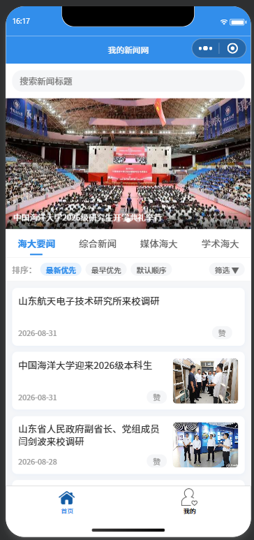

首页默认状态：顶部搜索栏、跟随分类的轮播图（带标题条）、分类标签栏、排序/筛选栏、新闻列表（左文字右图，每条带「赞」按钮）。

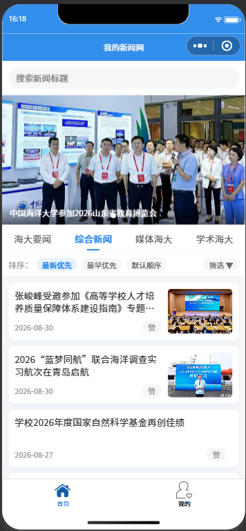

点击分类标签（如「综合新闻」）后，轮播图和新闻列表同步切换为对应分类的内容。

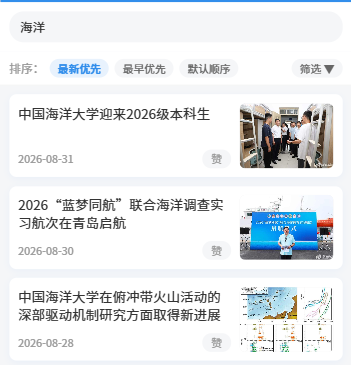

在搜索栏输入关键词（如「海洋」）后的搜索结果。

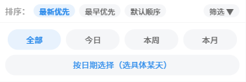

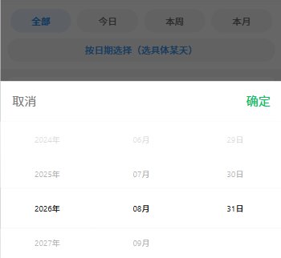

点击「筛选」按钮展开时间筛选面板（今日 / 本周 / 本月 + 按日期选择）。

**新闻详情页**


新闻详情页：标题、作者/来源/时间、海报图、图文混排正文、署名，底部「收藏」「点赞」两个按钮。

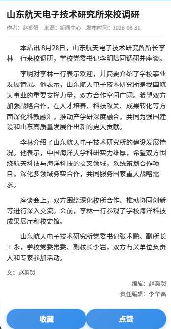

无图新闻的详情页（不显示海报图，直接从标题到正文）。

**个人中心页**

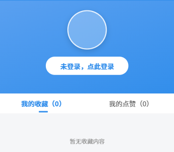

个人中心页未登录状态（显示「未登录，点此登录」）。

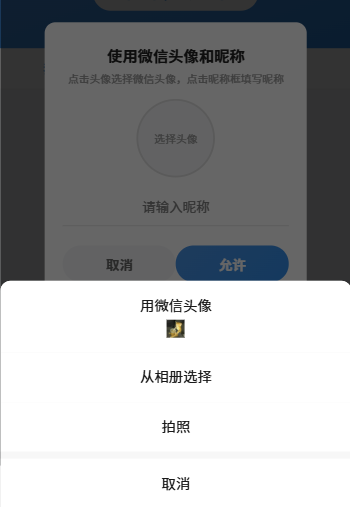

点击登录后弹出的「使用微信头像和昵称」弹框（头像选择 + 昵称输入）。

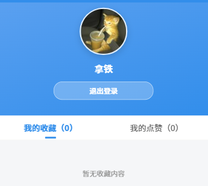

登录后：头像、昵称、「退出登录」按钮，以及「我的收藏 / 我的点赞」两个标签。

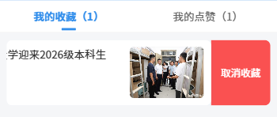

收藏列表向左滑，滑出红色「取消收藏」按钮。

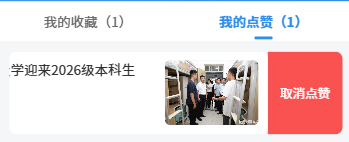

点赞列表向左滑，滑出红色「取消点赞」按钮。

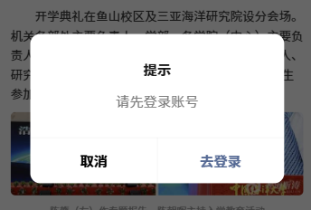

未登录时点击收藏/点赞弹出的「请先登录账号」提示框。

### 1.6 扩展与完善

在完成基础功能的基础上，本实验还做了以下几点完善：

1. **替换为最新分类新闻数据**：将教程中 2022 年的 4 条模拟数据替换为中国海洋大学新闻网 2026 年最新的 24 条新闻，并仿照官网分为「海大要闻 / 综合新闻 / 媒体海大 / 学术海大」四类（各 6 条），配以真实新闻图片；
2. **分类展示 + 轮播跟随分类**：首页新增分类标签栏，切换分类时新闻列表和轮播图同步更新；轮播图不再写死，而是动态取当前分类下有图新闻，无图新闻自动跳过；
3. **搜索功能**：新增搜索栏，按标题关键词跨分类搜索，输入即出结果，清空恢复原列表；
4. **排序功能**：支持「最新优先（时间倒序）/ 最早优先（时间正序）/ 默认顺序」三种排序；
5. **时间筛选功能**：新增「筛选」入口，支持「今日 / 本周 / 本月」快捷筛选，以及用微信原生日历（`picker mode="date"`）按具体日期筛选；
6. **点赞功能**：详情页和首页列表均支持点赞/取消点赞，个人中心可查看点赞列表；
7. **登录弹框 + 退出登录**：登录改用官方推荐的「头像昵称填写」能力（`open-type="chooseAvatar"` + `input type="nickname"`），头像持久化存储，并新增退出登录；
8. **个人中心收藏/点赞双标签 + 左滑删除**：收藏和点赞分两个标签展示，列表支持左滑滑出「取消收藏 / 取消点赞」按钮；
9. **统一缓存封装 `store.js`**：将收藏、点赞、用户信息的本地缓存读写收敛到独立模块，避免散乱存储和逻辑重复；
10. **无图新闻处理与界面美化**：无图新闻的 `poster` 置空，列表和详情页用 `wx:if` 条件渲染（不显示占位图）；列表改为圆角卡片、左文字右图布局，收藏/点赞按钮改为渐变胶囊按钮，登录头部为蓝色渐变背景。

## 二、问题总结与体会

**遇到的问题及解决：**

1. **新闻图片体积超出主包 2MB 限制**：从新闻网站抓取的 50 张图片总大小约 3.4MB，超过了微信小程序主包 2MB 的体积上限，导致无法预览/上传。解决方法是编写图片压缩脚本（PowerShell + Python Pillow），把图片统一缩放到 720px 宽度、JPEG 质量 48，最终项目体积降到约 1.79MB（图片约 1.64MB），既满足体积限制又保证清晰度，同时保留了原始图片备份。

2. **`wx.getUserProfile` 已废弃拿不到真实头像昵称**：教程中登录用的是 `wx.getUserProfile`，但微信自 2022 年起已废弃该接口，真机只能拿到灰色默认头像和「微信用户」昵称。解决方法是改用官方推荐的「头像昵称填写」能力——`<button open-type="chooseAvatar">` 选择微信头像 + `<input type="nickname">` 自动带出微信昵称。

3. **chooseAvatar 返回临时路径导致头像重启失效**：`chooseAvatar` 返回的 `avatarUrl` 是临时文件路径，重启小程序后会失效、头像变空白。解决方法是拿到临时路径后用 `wx.getFileSystemManager().saveFile()` 保存为持久文件，再存入缓存。

4. **头像按钮呈椭圆**：直接用 `<button open-type="chooseAvatar">` 并设置 `width/height + border-radius:50%` 时，由于微信 `button` 元素默认的 `line-height`、`box-sizing` 等样式，实际渲染尺寸不是正方形，`border-radius:50%` 画出来就成了椭圆。解决方法是把「视觉圆形」和「按钮」分离：用 `view`/`image`（尺寸可控）作为显示层做正圆，透明 `button` 绝对定位覆盖在上面只负责点击触发选头像。

5. **无图新闻硬塞占位图不美观**：部分新闻本身没有配图，教程里统一用占位图填充。解决方法是把无图新闻的 `poster` 字段置空，列表和详情页用 `wx:if="{{item.poster}}"` 条件渲染，无图时右侧留白、详情页不显示海报图。

6. **时间筛选「今日/本周/本月」受当天影响**：相对时间筛选（今日/本周/本月）是按打开小程序当天的日期计算的，而新闻数据是静态的，如果当天不在数据日期范围内，会筛出空列表。这是相对时间筛选的固有限制，通过额外提供「按日期选择」日历（精确到某一天）来弥补。

**收获与体会：**

通过本次实验，我从零开始完整搭建了一个功能完整的新闻小程序，在原有「三页面 + 收藏」的基础上，进一步实现了分类展示、搜索、排序、时间筛选、点赞、登录弹框、退出登录、左滑删除等一系列功能，综合运用了 tabBar 配置、swiper 轮播、`wx.navigateTo` 页面跳转、本地缓存、头像昵称填写、文件持久化等 API，把前几个实验学到的 WXML / WXSS / JS 知识串联成了一个完整项目。

在完成过程中，我最大的收获是理解了**数据与视图分离**以及**状态与逻辑的合理组织**：新闻数据统一放在 `common.js` 中，列表、轮播、搜索、详情都通过公共函数获取；收藏、点赞、用户信息的缓存读写收敛到独立的 `store.js` 模块；登录状态放在 `globalData` 中供多个页面共享。这样各页面的逻辑变得清晰、易维护、易扩展——例如后面要加「时间筛选」，只需在首页的 `renderNewsList` 中插入一个 `filterByTime` 步骤，其它逻辑完全不用动。

此外，几个踩坑也让我体会到：**要关注 API 的时效性和真实行为**。比如 `wx.getUserProfile` 的废弃、`chooseAvatar` 返回临时路径会失效、`button` 默认样式会干扰布局等，这些都说明不能只照搬教程或文档，要结合官方最新文档和实际调试结果来判断。最后，通过解决图片体积超限、头像椭圆这类问题，我也意识到一个完整的小程序不仅要把功能做对，还要兼顾包体积、视觉细节和异常情况处理，才能真正上线运行、给用户良好的体验。
