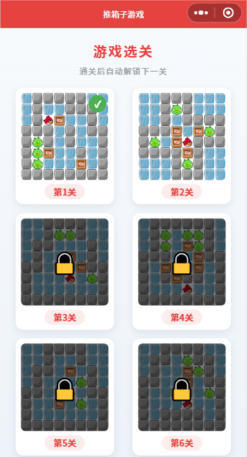
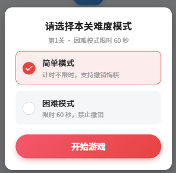
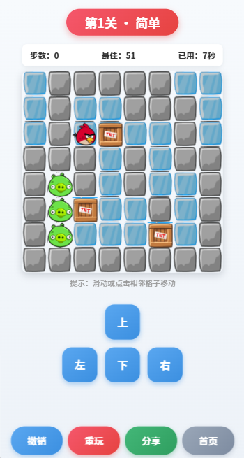
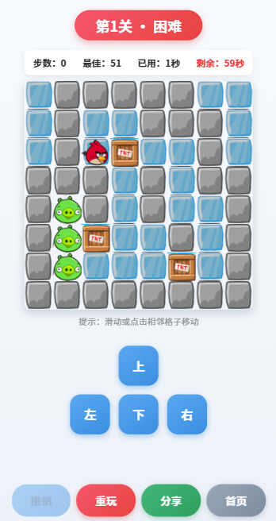
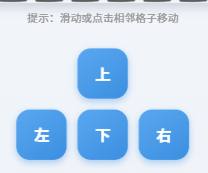
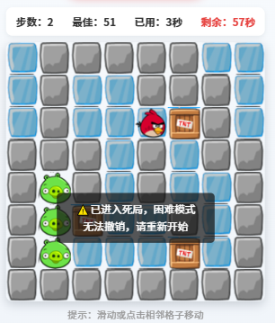
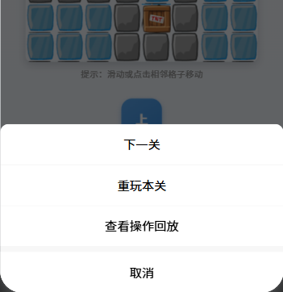
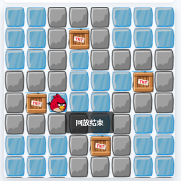
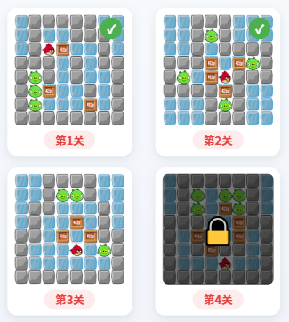

<center>姓名：沈卓娜  学号：24020007101</center>

| 姓名和学号？         | 沈卓娜，24020007101                                          |
| -------------------- | ------------------------------------------------------------ |
| 本实验属于哪门课程？ | 中国海洋大学26夏《移动软件开发》                             |
| 实验名称？           | 实验4：推箱子游戏                                            |
| 博客地址？           | [移动软件开发_实验4：推箱子游戏-CSDN博客](https://blog.csdn.net/natiedog/article/details/164256927?sharetype=blogdetail&sharerId=164256927&sharerefer=PC&sharesource=natiedog&spm=1011.2480.3001.8118) |
| 代码仓库地址？       | https://github.com/shen5920/Mobile-Software-Development/tree/main/lab4 |

## 一、实验内容

### 1.1 实验目的

1. 综合运用所学的小程序基础知识，从零创建完整的推箱子小游戏；
2. 熟练掌握 `<canvas>` 组件和绘图 API（`wx.createCanvasContext` + `drawImage`）的实际用法；
3. 掌握触摸事件（滑动、点击）、定时器、本地缓存（解锁进度、最佳记录）、音频播放等 API；
4. 在此基础上扩展难度模式、限时挑战、悔棋、死局检测、分享、操作回放等进阶功能，并解决真机调试中的原生组件层级等问题。

### 1.2 项目创建与目录结构

本实验来源于周文洁老师的《微信小程序开发实战》第十三章。新建项目后，将游戏贴图（`icons/`）、关卡预览图（`level01~16.png`）放入 `images/`，新增 `utils/data.js` 存放关卡数据，并添加 `pages/game` 游戏页面。

最终项目目录结构如下：

```
实验4/
├── app.js                 // 小程序入口逻辑文件
├── app.json               // 全局配置（页面、导航栏）
├── app.wxss               // 全局样式（页面背景、容器、标题）
├── project.config.json    // 项目（工具）配置文件
├── sitemap.json           // 页面收录配置
├── images/                // 图片与音效资源
│   ├── icons/             // 游戏贴图（bird 小鸟/box 箱子/ice 路面/stone 墙/pig 终点）
│   ├── level01.png ~ level16.png  // 16 张关卡预览图（选关页用）
│   └── sounds/            // 音效（move 移动 / push 推箱 / win 通关）
├── utils/
│   └── data.js            // 16 关地图数据
└── pages/                 // 页面目录
    ├── index/             // 选关页（关卡卡片、解锁锁定、通关标记）
    └── game/              // 游戏页（画布、操作、难度弹窗、回放等）
```

### 1.3 视图设计

#### 1.3.1 导航栏设计

在 `app.json` 中配置导航栏为红色主题：

```json
{
  "pages": ["pages/index/index", "pages/game/game"],
  "window": {
    "navigationBarBackgroundColor": "#E64340",
    "navigationBarTitleText": "推箱子游戏",
    "navigationBarTextStyle": "white"
  }
}
```

#### 1.3.2 选关页设计

选关页以卡片网格展示 16 个关卡，每张卡片包含关卡预览图、「第X关」标签；已通关关卡右上角显示绿色 ✓ 标记，未解锁关卡盖半透明遮罩并显示 🔒：

```xml
<view class='box' wx:for='{{levels}}' wx:key='num'
      bindtap='chooseLevel' data-level='{{index}}' hover-class='box-hover'>
  <view class='box-card'>
    <view class='box-img-wrap'>
      <image src='{{item.src}}'></image>
      <view wx:if='{{item.done}}' class='done-mark'>✓</view>
      <view wx:if='{{item.locked}}' class='lock-mask'>🔒</view>
    </view>
    <text class='level-tag'>第{{item.num}}关</text>
  </view>
</view>
```

#### 1.3.3 难度模式选择弹窗

进入关卡后、游戏开始前弹出难度选择弹窗（简单模式 / 困难模式），说明两种模式区别，点「开始游戏」后才开始：

```xml
<view class='modal-mask' wx:if='{{showModeModal}}'>
  <view class='modal'>
    <view class='modal-title'>请选择本关难度模式</view>
    <view class='modal-desc'>第{{level}}关 · 困难模式限时 {{timeLimit}} 秒</view>
    <radio-group bindchange='onModeSelect'>
      <label class='modal-mode {{mode === "easy" ? "modal-mode--active" : ""}}'>
        <radio value='easy' checked='{{mode === "easy"}}' color='#E64340'/>
        <view class='modal-mode-text'>
          <text class='modal-mode-name'>简单模式</text>
          <text class='modal-mode-sub'>计时不限时，支持撤销悔棋</text>
        </view>
      </label>
      <label class='modal-mode {{mode === "hard" ? "modal-mode--active" : ""}}'>
        <radio value='hard' checked='{{mode === "hard"}}' color='#E64340'/>
        <view class='modal-mode-text'>
          <text class='modal-mode-name'>困难模式</text>
          <text class='modal-mode-sub'>限时 {{timeLimit}} 秒，禁止撤销</text>
        </view>
      </label>
    </radio-group>
    <button class='modal-start' bindtap='startGame'>开始游戏</button>
  </view>
</view>
```

**注意：** 弹窗打开期间画布用 `wx:if='{{!showModeModal}}'` **不渲染**，等弹窗关闭后再创建画布——因为真机上原生 `<canvas>` 层级最高，会盖住普通视图（详见问题总结）。

#### 1.3.4 游戏页设计

游戏页自上而下为：关卡标题徽章（带难度模式）、信息栏（步数 / 最佳 / 已用时间，困难模式额外显示剩余倒计时）、游戏画布、方向控制键、操作栏（撤销 / 重玩 / 分享 / 首页）：

```xml
<view class='level-title'>第{{level}}关 · {{mode === 'hard' ? '困难' : '简单'}}</view>
<view class='info-bar'>
  <text>步数：{{steps}}</text>
  <text>最佳：{{bestStep}}</text>
  <text>已用：{{timeText}}</text>
  <text wx:if='{{mode === "hard"}}' class='countdown-text {{countdown <= 10 ? "countdown-danger" : ""}}'>剩余：{{countdown}}秒</text>
</view>
<canvas wx:if='{{!showModeModal}}' canvas-id='myCanvas' bindtouchstart='touchStart' bindtouchend='touchEnd'></canvas>
<view class='btnBox'>
  <button class='ctrl-btn' bindtap='moveUp' disabled='{{replaying}}'>上</button>
  <view>
    <button class='ctrl-btn' bindtap='moveLeft' disabled='{{replaying}}'>左</button>
    <button class='ctrl-btn' bindtap='moveDown' disabled='{{replaying}}'>下</button>
    <button class='ctrl-btn' bindtap='moveRight' disabled='{{replaying}}'>右</button>
  </view>
</view>
<view class='action-bar'>
  <button class='act-btn act-btn--undo' bindtap='undoStep' disabled='{{mode === "hard" || replaying}}'>撤销</button>
  <button class='act-btn act-btn--restart' bindtap='restartGame' disabled='{{replaying}}'>重玩</button>
  <button class='act-btn act-btn--share' open-type='share'>分享</button>
  <button class='act-btn act-btn--home' bindtap='goHome'>首页</button>
</view>
```

### 1.4 逻辑实现

#### 1.4.1 `utils/data.js` —— 16 关地图数据

地图用二维数组表示，图例：**0=外围、1=墙、2=路、3=终点、4=箱子、5=人物、6=箱子已在终点上**。前 8 关为 8×8 地图，后 8 关为 10×10 / 12×12 大尺寸地图，箱子数从 2 个递增到 9 个：

```js
// 第9关地图（10x10，5箱）节选
var map9 = [
  [1,1,1,1,1,1,1,1,1,1],
  [1,2,2,5,2,2,3,6,2,1],
  [1,2,2,2,2,2,2,2,2,1],
  // …… 
];

// 导出 16 关
module.exports = {
  maps: [map1, map2, ..., map16]
}
```

**关卡的可解性验证**：手写关卡容易出「无解」bug（原教程第 3 关经求解器验证就是无解的，AI 建议的关卡也存在箱子数与目标数不符）。因此我编写了 **Python 推箱子求解器**（A* 搜索）逐一验证；后 8 关改用**反向生成法**——先把箱子放在目标上，再随机「反向拉箱子」打乱布局，每一步都记录，最后**正向模拟解路径**确认可通关，数学上保证可解。

#### 1.4.2 选关页逻辑（解锁 + 通关标记）

```js
buildLevels: function () {
  let unlocked = wx.getStorageSync('unlocked_level') || 1
  let levels = this.data.levelNames.map(function (name, i) {
    return {
      src: '/images/' + name,
      num: i + 1,
      locked: i + 1 > unlocked,
      done: wx.getStorageSync('best_step_' + i) != ''  // 有最佳步数记录视为已通关
    }
  })
  this.setData({ levels: levels, unlockedLevel: unlocked })
},

chooseLevel: function (e) {
  let levelIndex = parseInt(e.currentTarget.dataset.level)
  if (levelIndex + 1 > this.data.unlockedLevel) {
    wx.showToast({ title: '请先通关上一关', icon: 'none' })
    return
  }
  wx.navigateTo({ url: '../game/game?level=' + levelIndex })
}
```

解锁进度（`unlocked_level`）和每关最佳步数（`best_step_<关卡下标>`）都存本地缓存，`onShow` 时刷新，保证通关返回后状态实时更新。

#### 1.4.3 游戏页核心逻辑

**地图初始化（支持任意尺寸）**：按关卡尺寸动态创建图层，画布固定 320px，方块大小和居中偏移按行列数计算：

```js
rows = originMap.length
cols = originMap[0].length
blockSize = Math.floor(canvasSize / Math.max(rows, cols))
offsetX = Math.floor((canvasSize - blockSize * cols) / 2)
offsetY = Math.floor((canvasSize - blockSize * rows) / 2)
```

**画布绘制**：遍历地图底层（路面 ice / 墙 stone / 终点 pig），叠加箱子 box、人物 bird：

```js
ctx.drawImage('/images/icons/' + imgName + '.png',
  offsetX + j * blockSize, offsetY + i * blockSize, blockSize, blockSize)
```

**统一移动逻辑**：四种方向共用 `moveTo(dRow, dCol)`，处理撞墙、推箱、步数计数、操作记录、音效、死局检测与通关检测：

```js
moveTo: function (dRow, dCol) {
  if (this.data.showModeModal) return   // 弹窗未确认难度前不响应
  let nr = playerRow + dRow, nc = playerCol + dCol
  if (map[nr][nc] === 1) return          // 撞墙
  if (box[nr][nc] === 4) {               // 前方是箱子：尝试推动
    // …… 推动条件检查、更新箱子图层、步数+1、播放 push 音效
  } else {                               // 空地：直接移动
    // …… 步数+1、播放 move 音效
  }
  moveRecord.push(dRow === -1 ? 'up' : dRow === 1 ? 'down' : dCol === -1 ? 'left' : 'right')
  this.drawCanvas()
  this.checkDeadlock()
  this.checkWin()
}
```

**三种操作方式**：方向按钮直接调用 `moveTo`；滑动操作记录起点（`clientX/Y`），结束时位移小于 20px 视为点击格子，否则按横纵位移大小判定方向；点击格子用画布相对坐标（`e.touches[0].x/y`）换算行列，仅相邻格子响应。

**难度模式与计时**：弹窗确认后 `startGame` 才创建画布并启动计时。困难模式限时按关卡分层（`60 + Math.floor(levelIndex / 4) * 30`，即 1-4 关 60 秒、5-8 关 90 秒、9-12 关 120 秒、13-16 关 150 秒），倒计时归零弹「时间耗尽，挑战失败！」；简单模式只累计已用时间。定时器在通关、超时、`onUnload` 时清除，防止泄漏。

**悔棋与操作回放**：悔棋用历史栈保存移动前的玩家位置和箱子布局（最多 20 步），困难模式禁用；`moveRecord` 记录每步方向。通关后 `showActionSheet` 提供「下一关 / 重玩本关 / 查看操作回放」，回放时备份当前状态 → 重置初始地图 → 屏蔽全部交互 → 每 400ms 执行一步 → 结束恢复并 toast「回放结束」。

**死局检测**：每次移动后遍历箱子，若某箱子**不在终点且相邻两个方向都是墙**（角落死局），提示玩家撤销或重开（困难模式提示无法撤销）——注意只有相对两方向是墙（如上下都是墙）不算死局，箱子还能沿走廊滑动：

```js
if ((up && left) || (up && right) || (down && left) || (down && right)) {
  wx.showToast({ title: this.data.mode === 'hard'
    ? '⚠️已进入死局，困难模式无法撤销，请重新开始'
    : '⚠️已进入死局，可以撤销或者重新开始', icon: 'none', duration: 2000 })
}
```

**分享**：`onShareAppMessage` 携带 `level` 和 `mode` 参数，好友点开分享卡片直接进入对应关卡和难度：

```js
onShareAppMessage: function () {
  return {
    title: '第' + this.data.level + '关 推箱子挑战，快来试试！',
    path: '/pages/game/game?level=' + (this.data.level - 1) + '&mode=' + this.data.mode,
    imageUrl: '/images/level' + (this.data.level < 10 ? '0' + this.data.level : this.data.level) + '.png'
  }
}
```

#### 1.4.4 素材制作

- **音效**：没有现成音效文件，用 Python `wave` 模块合成了三个短音效（移动 520Hz 短音、推箱 240Hz 低音、通关上行琶音 C5-E5-G5-C6），存入 `images/sounds/`；
- **关卡预览图**：用 Python PIL 把每关地图按图例渲染成 242×242 的预览图（8×8 瓦片 30px、10×10 24px、12×12 20px），风格与游戏内一致，选关页直接引用。

### 1.5 运行效果

#### 1.5.1 运行结果截图

**选关页**



选关页：16 个关卡卡片，未解锁关卡有 🔒 遮罩，已通关关卡有 ✓ 标记。

**难度选择弹窗**



进入关卡后弹出的难度模式选择弹窗（简单 / 困难，显示本关限时）。

**游戏页**



简单模式游戏页：地图 + 信息栏（步数 / 最佳 / 已用时间）+ 方向键 + 操作栏。



困难模式游戏页：显示剩余倒计时，撤销按钮置灰禁用。



可使用三种方式进行推箱子操作：按键（上下左右）、滑动、点击相邻格子

**功能提示**



把箱子推进角落时弹出的死局提示 toast。

**通关流程**



通关后弹出的底部菜单：下一关 / 重玩本关 / 查看操作回放。



操作回放（每 400ms 自动回放一步，期间按钮全部禁用）。


困难模式倒计时归零弹出的「时间耗尽，挑战失败！」弹窗（重新开始 / 返回选关）。



通关返回选关页：下一关已解锁、本关右上角显示 ✓ 标记。

### 1.6 扩展与完善

在完成基础推箱子功能的基础上，本实验还做了以下几点完善：

1. **16 个关卡，难度梯度化**：8×8（2~5 箱）→ 10×10（5~6 箱）→ 12×12（7~9 箱），全部经求解器验证可解；
2. **三种操作方式**：方向按钮、画布滑动、点击相邻格子直接移动；
3. **难度模式**：进入关卡先弹窗选择——简单模式计时不限时、支持撤销；困难模式限时挑战、禁止撤销、超时失败；
4. **分层限时**：困难模式限时随关卡递增（60 / 90 / 120 / 150 秒）；
5. **成绩记录**：步数、每关最佳步数、每关最佳通关时间均存本地缓存；
6. **关卡解锁系统**：通关解锁下一关，选关页显示锁定/通关状态；
7. **悔棋**：最多撤销 20 步；
8. **死局检测**：角落死局实时提示；
9. **分享**：携带关卡与难度参数，好友直接进入对应关卡；
10. **操作回放**：通关后可观看本局完整操作过程；
11. **游戏音效**：移动、推箱、通关音效；
12. **界面美化**：渐变背景、圆角卡片、主题色按钮、倒计时低电量警示。

## 二、问题总结与体会

**遇到的问题及解决：**

1. **原教程第 3 关无解**：用 Python 编写的推箱子求解器（A* 搜索）验证发现，教程自带的第 3 关地图实际上是解不出来的（箱子布局存在死局），照抄会卡关。解决方法是替换为经过求解器验证的可解关卡，并用求解器验证全部 16 关。
2. **真机上原生 canvas 盖住弹窗**：开发者工具里难度弹窗正常显示，但真机预览时画布浮在弹窗上面。原因是旧版 `<canvas>` 是原生组件，真机上层级永远高于普通视图，`z-index` 无效。解决方法是弹窗打开期间不渲染画布（`wx:if='{{!showModeModal}}'`），玩家确认难度、弹窗关闭后才创建画布上下文并绘制。
3. **死局检测误报**：最初按「上下都是墙或左右都是墙」判定死局，导致走廊里还能滑动的箱子被误报。正确的判定是**角落死局**——箱子相邻两个方向都是墙才真正无法移动（四个方向的推动要么站不进人、要么推入墙中）。
4. **定时器泄漏与状态竞争**：计时器、倒计时、回放定时器如果不在合适时机清除，会出现「通关后还在倒计时」「超时弹窗与通关弹窗打架」等问题。解决方法是统一封装 `startTimer` / `stopTimer`，在通关、超时、页面卸载（`onUnload`）时全部清理，并用 `_won` 标志防止超时与通关同时触发。
6. **滑动与点击的坐标换算**：滑动用视口坐标（`clientX/Y`）算位移方向，点击格子必须用画布相对坐标（`e.touches[0].x/y`）除以方块大小换算行列，还要考虑大尺寸地图的居中偏移（`offsetX/offsetY`），否则点击位置会偏。

**收获与体会：**

通过本次实验，我完成了一个功能完整的推箱子小游戏，从画布绘制、触摸操作到难度模式、限时挑战、悔棋、死局检测、分享、操作回放，综合运用了 canvas 绘图 API、触摸事件、定时器、本地缓存、音频播放等小程序能力，把前几个实验学到的知识串联成了一个可玩性较高的完整项目。

最大的收获是**用工具验证数据，而不是凭感觉**。推箱子关卡「看着能解」和「真的能解」是两回事——教程自带关卡都有无解的情况，AI 给的关卡更是箱子数都对不上。我写了一个求解器逐关验证，再用「反向生成」的方法从终局倒推生成关卡，从根源上保证了 16 个关卡全部可解。这个思路同样适用于其它数据驱动的小程序功能。

其次，**真机与模拟器的差异**给我上了重要一课：模拟器正常不代表真机正常，原生 canvas 的层级问题只有真机预览才能暴露出来。调试时应该尽早用真机预览验证关键交互，而不是最后才发现问题。

最后，通过限时、死局提示、回放这些细节功能，我体会到好的游戏体验不仅在于核心玩法，还在于对玩家失败时的引导（提示死局、允许悔棋）、对操作自由的尊重（三种移动方式）和复盘能力（操作回放），这些细节共同构成了完整的用户体验。
