<center>姓名：沈卓娜  学号：24020007101</center>

| 姓名和学号？         | 沈卓娜，24020007101                                          |
| -------------------- | ------------------------------------------------------------ |
| 本实验属于哪门课程？ | 中国海洋大学26夏《移动软件开发》                             |
| 实验名称？           | 实验5：鸿蒙开发入门及计算器开发                              |
| 博客地址？           |                                                              |
| 代码仓库地址？       | https://github.com/shen5920/Mobile-Software-Development/tree/main/lab5 |

## 一、实验内容

### 1.1 实验目的

1. 熟悉 DevEco Studio 的下载安装与鸿蒙应用开发环境搭建，了解 HarmonyOS NEXT 的应用架构；
2. 掌握 ArkTS 语言基础与 ArkUI 声明式 UI 开发范式，理解 @State、@Builder、@StorageLink 等状态管理装饰器的用法；
3. 实现一款功能完整的计算器应用，包含普通计算器、科学计算器、单位换算、历史记录四大基础模块；
4. 在此基础上扩展函数绘图（Canvas 自定义绘制）、日期计算、多类别换算等进阶功能；
5. 掌握全屏布局适配、页面路由、自定义弹窗、Canvas 绘图等鸿蒙开发核心技能。

### 1.2 开发环境准备

本实验使用华为官方提供的 **DevEco Studio** 进行鸿蒙应用开发，SDK 版本为 **HarmonyOS NEXT 6.0.2 (API 22)**。DevEco Studio 基于 IntelliJ IDEA 社区版构建，安装时需勾选 HarmonyOS SDK 组件，安装完成后通过 Tools → SDK Manager 确认 API Version 已安装。

创建项目时选择 **Empty Ability** 模板，语言选择 ArkTS，编译 SDK 选择 API 22，项目命名为 Calculator，存储路径为 `F:\deveco`。

### 1.3 项目创建与目录结构

创建完成后，在参考样例项目 `Calculator` 的基础上进行功能扩展。最终项目的核心目录结构如下：

```
deveco/
├── AppScope/                    // 应用全局配置
│   └── resources/base/element/
│       └── string.json          // 应用名称（已改为"计算器"）
├── entry/src/main/
│   ├── ets/
│   │   ├── entryability/
│   │   │   └── EntryAbility.ets // 应用入口，全屏+状态栏避让
│   │   ├── pages/
│   │   │   ├── HomePage.ets     // 主页（普通/科学计算器）
│   │   │   ├── ConvertPage.ets  // 单位换算页
│   │   │   ├── HistoryPage.ets  // 历史记录页
│   │   │   ├── OtherPage.ets    // "其他"页（绘图/日期/换算入口）
│   │   │   ├── DrawPage.ets     // 函数绘图页
│   │   │   └── DateCalcPage.ets // 日期计算页
│   │   ├── common/
│   │   │   ├── constants/
│   │   │   │   └── CommonConstants.ets  // 常量定义
│   │   │   └── util/
│   │   │       ├── SciCalculateUtil.ets // 科学计算引擎（调度场算法）
│   │   │       ├── FuncEvalUtil.ets     // 函数表达式求值器（绘图用）
│   │   │       ├── HistoryUtil.ets      // 历史记录管理
│   │   │       ├── CalculateUtil.ets    // 普通计算工具（移植自参考项目）
│   │   │       ├── CheckEmptyUtil.ets
│   │   │       └── Logger.ets
│   │   └── viewmodel/          // 移植自参考项目的视图模型
│   └── resources/base/
│       ├── element/            // color.json / string.json
│       ├── media/              // 图片资源
│       └── profile/
│           └── main_pages.json // 页面路由配置
└── build-profile.json5         // 构建配置（targetSdk=22）
```

页面路由在 `main_pages.json` 中注册，共六个页面：

```json
{
  "src": [
    "pages/HomePage",
    "pages/ConvertPage",
    "pages/HistoryPage",
    "pages/OtherPage",
    "pages/DrawPage",
    "pages/DateCalcPage"
  ]
}
```

### 1.4 应用入口与全屏布局适配

#### 1.4.1 EntryAbility 入口配置

`EntryAbility.ets` 是应用的入口 Ability，在 `onWindowStageCreate` 中加载主页 `pages/HomePage`，并设置窗口全屏布局。全屏后系统状态栏和导航条会覆盖在应用内容之上，因此需要获取避让区域高度并传递给各页面：

```typescript
windowStage.loadContent('pages/HomePage', (err) => {
  let windowClass = windowStage.getMainWindowSync();
  // 设置窗口全屏
  windowClass.setWindowLayoutFullScreen(true);
  // 获取状态栏高度（TYPE_SYSTEM）
  let type = window.AvoidAreaType.TYPE_SYSTEM;
  let avoidArea = windowClass.getWindowAvoidArea(type);
  AppStorage.setOrCreate('topRectHeight', avoidArea.topRect.height);
  // 获取导航条高度（TYPE_NAVIGATION_INDICATOR）
  type = window.AvoidAreaType.TYPE_NAVIGATION_INDICATOR;
  avoidArea = windowClass.getWindowAvoidArea(type);
  AppStorage.setOrCreate('bottomRectHeight', avoidArea.bottomRect.height);
  // 注册监听，横竖屏切换时动态更新避让区域
  windowClass.on('avoidAreaChange', (data) => {
    if (data.type === window.AvoidAreaType.TYPE_SYSTEM) {
      AppStorage.setOrCreate('topRectHeight', data.area.topRect.height);
    }
  });
});
```

**解释：**
- `setWindowLayoutFullScreen(true)` 让应用内容延伸到状态栏和导航条区域，实现沉浸式布局；
- `getWindowAvoidArea` 获取系统栏的像素高度，存入 `AppStorage` 全局共享；
- `on('avoidAreaChange')` 监听避让区域变化（如旋转屏幕），动态更新高度；
- 各页面通过 `@StorageLink('topRectHeight')` 接收高度，用 `uiContext.px2vp()` 将像素转为 vp 单位设置 margin。

#### 1.4.2 应用名称中文化

将 `AppScope/resources/base/element/string.json` 和 `entry/src/main/resources/base/element/string.json` 中的 `app_name` 和 `label` 均从英文改为「计算器」，确保桌面图标和任务栏显示中文名称。

### 1.5 普通计算器

普通计算器为四列圆形按键布局，包含 AC（清空）、%（百分数）、del（删除）、÷×−+ 四则运算、00/0/. 数字键和橙色等号。表达式显示区支持点击定位光标，在任意位置插入或删除字符。

按键数据通过二维数组定义，每一项包含 `value`（显示文字）和 `type`（类型：num/op/action/equal）：

```typescript
private normalKeys: KeyButton[][] = [
  [{ value: 'AC', type: 'action' }, { value: '%', type: 'action' },
   { value: 'del', type: 'action' }, { value: '÷', type: 'op' }],
  [{ value: '7', type: 'num' }, { value: '8', type: 'num' },
   { value: '9', type: 'num' }, { value: '×', type: 'op' }],
  // ... 其余行
];
```

表达式编辑采用 `TextInput` 组件配合 `TextInputController` 实现光标定位。关键是设置 `enableKeyboardOnFocus(false)` 禁用系统软键盘，所有输入通过自定义按键完成：

```typescript
TextInput({ text: $$this.expression, placeholder: '0', controller: this.inputController })
  .enableKeyboardOnFocus(false)
  .onTextSelectionChange((start: number, end: number) => {
    this.caretPos = start;  // 记录光标位置
  })
```

在光标处插入字符的核心方法：

```typescript
private insertAtCaret(text: string): void {
  let before = this.expression.substring(0, this.caretPos);
  let after = this.expression.substring(this.caretPos);
  this.expression = before + text + after;
  this.caretPos = before.length + text.length;
  this.inputController.caretPosition(this.caretPos);  // 同步光标
}
```

> 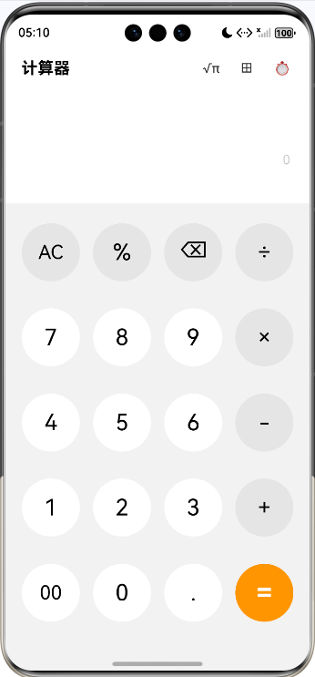

### 1.6 科学计算器

#### 1.6.1 计算引擎设计

科学计算器的核心是独立封装的 `SciCalculateUtil` 类，采用**调度场算法（Shunting-yard Algorithm）**将中缀表达式转为逆波兰表达式（RPN）后求值。支持的运算符包括 + − × ÷ ^（幂）!（阶乘）%（百分数）mod（取模），支持的函数包括 sin/cos/tan 及其反函数 asin/acos/atan、双曲函数 sinh/cosh/tanh、log/ln/sqrt/abs/exp/floor/ceil/frac，常量 π 和 e。

求值入口 `evaluate` 方法的处理流程：

```typescript
evaluate(expr: string): string {
  // 1. 自动补全未闭合的左括号（如 sin(30 → sin(30)）
  let balanced = this.balanceParens(expr);
  // 2. 替换常量 π 和独立的 e（单词边界避免匹配函数名中的e）
  let processed = balanced.replace(/π/g, '(' + Math.PI + ')')
    .replace(/\be\b/g, '(' + Math.E + ')');
  // 3. 分词 → 4. 中缀转逆波兰 → 5. 逆波兰求值
  let tokens = this.tokenize(processed);
  let rpn = this.toRPN(tokens);
  let result = this.evalRPN(rpn);
  return this.formatResult(result);
}
```

`balanceParens` 自动补全括号是关键容错设计——用户输入 `sin(30` 后直接按等号，引擎会自动补为 `sin(30)` 再计算，避免因漏按右括号导致全部显示"错误"。

#### 1.6.2 科学计算器界面

科学计算器严格参考参考应用设计，自上而下包含四个区域：

1. **状态行**：DEG/RAD（点击切换角度制）、F-E、2nd/HYP/M 状态指示灯；
2. **内存键行**：MC（清内存）、MR（读入）、M+（加）、M-（减）、MS（存）、M⌄（读出并清空）；
3. **下拉菜单行**：「三角学 ▼」和「函数 ▼」两个可展开菜单；
4. **主键盘**：七行五列圆形按键，等号为青色。

三角学下拉展开后显示 2nd / sin cos tan / hyp sec csc cot 八个键，其中 2nd 开启后 sin→asin、cos→acos、tan→atan；hyp 开启后 sin→sinh、cos→cosh、tan→tanh；两者同时开启则为 asinh/acosh/atanh。sec/csc/cot 分别转换为 1/cos(、1/sin(、1/tan(。

函数下拉展开后显示 |x|（绝对值）、[x]（向下取整 floor）、⌈x⌉（向上取整 ceil）、{x}（小数部分 frac）、rand（随机数）。

内存功能的实现：

```typescript
private onMemKey(label: string): void {
  if (label === 'MC') {
    this.memory = 0;
  } else if (label === 'MR') {
    this.insertAtCaret(this.memory.toString());
  } else if (label === 'M+') {
    let val = Number(SciCalculateUtil.evaluate(this.expression));
    if (!isNaN(val)) this.memory += val;
  } else if (label === 'MS') {
    let val = Number(SciCalculateUtil.evaluate(this.expression));
    if (!isNaN(val)) this.memory = val;
  }
  // M-、M⌄ 类似
}
```

> 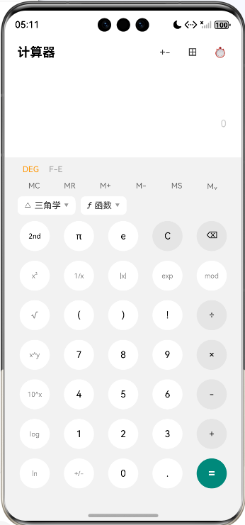
>
> 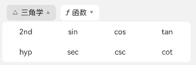
>
> 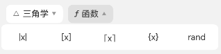

### 1.7 单位换算

单位换算模块包含**十个分类**：汇率、长度、面积、体积、重量、温度、速度、压强、功率、进制。入口页为三列网格，点击分类进入详情页。

#### 1.7.1 换算算法

除温度和进制外，其余分类均采用**线性因子换算**：每个单位定义一个 `factor`（1 单位 = factor 个基准单位），换算公式为 `结果 = 输入值 × fromFactor ÷ toFactor`。以长度为例，基准单位为米：

```typescript
private lengthUnits: UnitDef[] = [
  { name: '毫米', symbol: 'mm', factor: 0.001 },
  { name: '厘米', symbol: 'cm', factor: 0.01 },
  { name: '米',   symbol: 'm',  factor: 1 },
  { name: '千米', symbol: 'km', factor: 1000 },
  { name: '英里', symbol: 'mi', factor: 1609.344 },
  // ... 共12种单位
];
```

温度为非线性换算，单独处理——先将输入值转为摄氏度，再从摄氏度转为目标单位：

```typescript
private convertTemp(val: number, srcIdx: number, dstIdx: number): string {
  let c: number;
  if (srcIdx === 0) c = val;                  // 摄氏度
  else if (srcIdx === 1) c = (val - 32) * 5 / 9;  // 华氏度
  else c = val - 273.15;                      // 开尔文
  let result: number;
  if (dstIdx === 0) result = c;
  else if (dstIdx === 1) result = c * 9 / 5 + 32;
  else result = c + 273.15;
  return this.formatNum(result);
}
```

进制换算独立分支，使用 `parseInt(input, fromBase).toString(toBase)` 实现二/八/十/十六进制互转，并根据当前输入方进制自动置灰非法按键（如二进制下 A-F 键不可点）。

#### 1.7.2 双向输入与单位选择

详情页采用双卡片设计，上方卡片和下方卡片各显示一个单位的数值。点击任意卡片即将其设为输入方（橙色高亮），另一方实时反算结果。中间的 ⇅ 按钮可交换两个单位。

单位选择弃用了系统 `ActionSheet`（样式简陋），改为自定义全屏选择面板，顶部支持搜索框（按中文名/英文名/缩写过滤），下方按首字母 A-Z 分组展示，当前选中项右侧显示青色对勾：

```typescript
private getGroupedUnits(): Array<UnitGroup> {
  // 1. 按搜索词过滤
  let filtered = units.filter(u =>
    u.name.includes(search) || u.symbol.toLowerCase().includes(search)
    || (u.enName && u.enName.toLowerCase().includes(search))
  );
  // 2. 按英文名首字母分组（汇率有23种货币，按A-Z排序）
  let groupMap: Map<string, UnitDef[]> = new Map();
  for (let u of filtered) {
    let letter = u.enName ? u.enName.charAt(0).toUpperCase() : u.name.charAt(0);
    if (!groupMap.has(letter)) groupMap.set(letter, []);
    groupMap.get(letter).push(u);
  }
  // 3. 按字母排序返回
}
```

汇率分类收录了 23 种主流货币（AUD、BRL、CAD、CHF、CNY、DKK、EUR、GBP、HKD、INR、JPY、KRW、MXN、MYR、NOK、NZD、RUB、SEK、SGD、THB、TRY、USD、ZAR），以人民币为基准采用固定汇率。

> 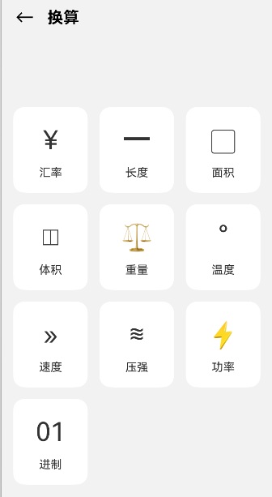
>
> 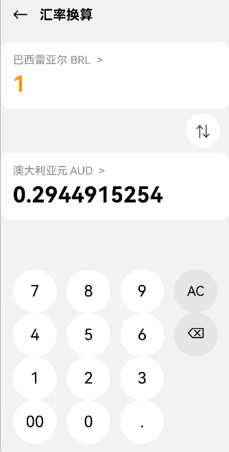
>
> 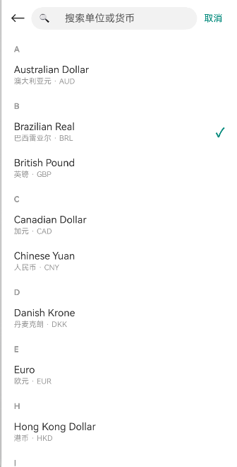

### 1.8 历史记录

历史记录基于 `AppStorage` 实现全局存储，最多保留 50 条。每次按等号计算成功后，将表达式、结果、时间戳存入历史列表。历史记录页支持单条左滑删除和一键清空，每条记录以白色卡片展示表达式、结果和日期。

```typescript
class HistoryUtil {
  private static readonly MAX = 50;
  static addHistory(expression: string, result: string): void {
    let list = AppStorage.get<HistoryItem[]>('history_list') || [];
    list.unshift({ expression, result, time: new Date().toLocaleString() });
    if (list.length > this.MAX) list = list.slice(0, this.MAX);
    AppStorage.setOrCreate('history_list', list);
  }
}
```

> 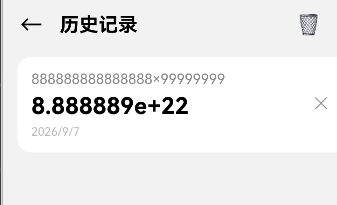

### 1.9 函数绘图

函数绘图页包含两个视图：**坐标视图**和**函数编辑视图**，通过右上角「坐标」「fx」按钮切换。

#### 1.9.1 坐标视图（Canvas 绘制）

坐标视图使用 `Canvas` 组件自定义绘制，包含网格线、X/Y 坐标轴、箭头、刻度标注和函数曲线。支持双指缩放、拖动平移，右下角三个圆形按钮分别为放大（+）、缩小（−）、回到原点（◎）。

绘制核心逻辑：

```typescript
private redraw(): void {
  let ctx = this.context;
  let cx = w / 2 + this.offsetX;   // 原点X坐标（像素）
  let cy = h / 2 + this.offsetY;   // 原点Y坐标（像素）
  let sc = this.zoomScale;         // 每单位像素数
  // 绘制网格
  ctx.strokeStyle = '#EAEAEA';
  let step = this.niceStep(48 / sc);  // 自适应刻度间距
  // 绘制坐标轴和箭头
  // 逐像素采样绘制函数曲线
  for (let px = 0; px < w; px++) {
    let x = (px - cx) / sc;
    let y = FuncEvalUtil.eval(expr, x);  // 函数求值
    let py = cy - y * sc;
    // 渐近线跳变时抬笔断开
  }
}
```

函数求值由独立的 `FuncEvalUtil` 完成，支持隐式乘法（`2x` → `2*x`）、一元负号、右结合幂运算、sin/cos/tan/asin/acos/atan/log/ln/sqrt/abs/exp/floor/ceil 等函数。

#### 1.9.2 函数编辑视图

函数编辑视图支持添加多个函数，每个函数可独立设置曲线颜色（6 色调色板）和粗细（细/中/粗），也可删除。函数键盘顶部配备「三角学」「不等式」「函数」三个下拉菜单，与科学计算器的下拉菜单一致。

函数列表使用 `ForEach` 渲染，关键是 `keyGenerator` 必须包含表达式、颜色、粗细等所有变化属性，否则修改函数后不会触发重新渲染：

```typescript
ForEach(this.funcs, (item: FuncItem) => {
  this.buildFuncRow(item);
}, (item: FuncItem) => item.id + '_' + item.expr + '_' + item.color + '_' + item.width);
```

由于 Canvas 是非响应式组件，每次修改函数后必须手动调用 `redraw()` 重绘画布。

> 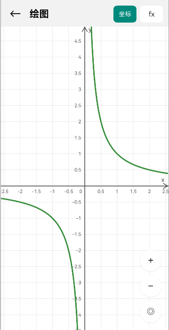
>
> 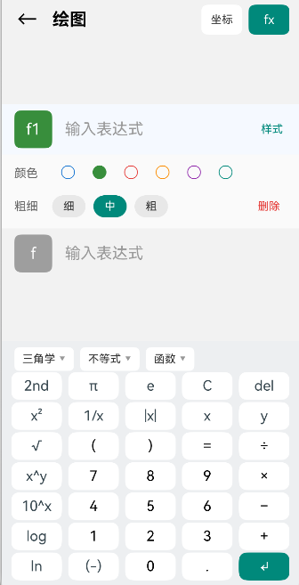

### 1.10 日期计算

日期计算页包含两个功能：**日期间隔**和**日期推算**。

日期间隔通过 `DatePickerDialog.show()` 弹出系统日期选择器，选择两个日期后自动计算相差天数。日期推算支持「加/减」切换按钮（解决了 TextInput type=Number 无法输入负号的问题），输入纯数字后计算目标日期，并提供 ±7 天、±30 天快捷键。

```typescript
// 日期推算：先选加减方向，再输入纯天数
@State addOrMinus: number = 1;  // 1=加, -1=减
private calcResult(): void {
  let base = new Date(this.startDate);
  let n = Number(this.days) || 0;
  base.setDate(base.getDate() + n * this.addOrMinus);
  this.resultDate = base.toLocaleDateString();
}
```

> 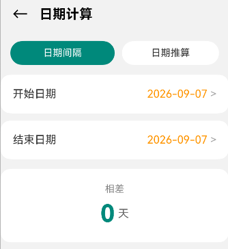
>
> 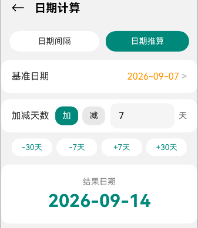

### 1.11 "其他"页

主页右上角第二个图标进入「其他」页，包含三个加粗靠左的分区入口：绘图（∿）、日期计算（日）、换算（⇄），点击分别跳转到对应功能页。

> 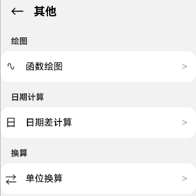

### 1.12 运行效果汇总

应用已在 DevEco Studio 模拟器中完成编译运行，所有六个页面均可正常访问，普通计算器、科学计算器、单位换算、历史记录、函数绘图、日期计算六大模块功能完整。编译环境为 HarmonyOS NEXT 6.0.2 (API 22)，构建工具为 hvigor。

## 二、问题总结与体会

**遇到的问题及解决：**

1. **@Builder 方法内出现编译错误 10905209/10905204**：在 `@Builder` 装饰的方法中写了 `let` 变量声明、`bgColor = '#FF9500'` 赋值语句和 `return` 语句，编译器报「Only UI component syntax can be written here」。根本原因是 ArkUI 的 `@Builder` 方法体内只允许编写 UI 组件语法，不允许任何普通逻辑语句。解决方式是将所有样式计算、变量声明抽取为普通方法（如 `getKeyBgColor()`、`getKeyTextColor()`），在 `@Builder` 内仅调用这些方法的返回值。

2. **右上角三个图标点击无反应且与状态栏重叠**：应用设置了全屏布局 `setWindowLayoutFullScreen(true)`，但页面顶部没有做状态栏避让，导致图标被压在系统状态栏下方，触摸事件被状态栏拦截。解决方式是在 `EntryAbility` 中通过 `getWindowAvoidArea` 获取状态栏像素高度并存入 `AppStorage`，各页面用 `@StorageLink` 接收后通过 `uiContext.px2vp()` 转为 vp 单位设置顶部 margin。同时需注意：DevEco Studio 的 Previewer 预览器不支持 `router` 页面跳转，必须在模拟器中运行才能测试页面跳转。

3. **科学计算器所有运算都显示"错误"**：用户输入 `sin(30` 后直接按等号（漏按右括号），未闭合的左括号在逆波兰求值时被当作运算符处理，返回 NaN。解决方式是在求值入口增加 `balanceParens` 方法，统计左括号多于右括号的数量，自动在表达式末尾补全 `)`。

4. **换算页自定义数字键盘只显示两行**：键盘的每一行使用了 `layoutWeight(1)` 弹性高度，当父容器高度不足时行被压缩到几乎不可见。解决方式是将键盘行改为固定高度 `72vp`，保证四行或五行按键完整显示。

5. **函数绘图页输入函数后曲线不实时更新**：原因有二。一是 `ForEach` 的 `keyGenerator` 仅使用函数 `id`，表达式/颜色/粗细变化时 key 不变，不触发列表重新渲染；二是 `Canvas` 是非响应式组件，数据变化后不会自动重绘。解决方式是将 key 改为 `id + '_' + expr + '_' + color + '_' + width`，并在所有修改函数的操作（添加、删除、改颜色、改粗细、键盘输入）末尾主动调用 `redraw()`。

6. **日期推算输入框无法输入负号**：`TextInput` 的 `type` 设为 `InputType.Number` 后，系统不接受 `+`/`-` 符号字符，导致用户输入 `-7` 只显示 `7` 且始终按加法计算。解决方式是增加「加/减」切换按钮，输入框仅接受纯数字，计算时根据切换方向决定 `n * addOrMinus`。

7. **计算器表达式只能在末尾追加/删除**：初期使用 `Text` 组件显示表达式，无法定位光标。解决方式是替换为 `TextInput`，设置 `enableKeyboardOnFocus(false)` 禁用系统软键盘，通过 `TextInputController.caretPosition()` 管理光标位置，`onTextSelectionChange` 监听用户点击移动光标，自定义键盘在 `caretPos` 位置插入或删除字符。注意该回调的正确名称是 `onTextSelectionChange` 而非 `onSelectionChange`。

8. **ActionSheet API 兼容性问题**：初期使用 `uiContext.showActionMenu` 报 `MenuElement` 类型不存在，改用全局 `ActionSheet.show({title, message, sheets})` 后又报 `message` 属性缺失——当前 SDK 版本中 `message` 为必填参数，且 `SheetInfo` 的属性名是 `title` 而非 `text`。最终因样式简陋，弃用系统 ActionSheet，改为自定义全屏选择面板。

9. **成员变量名 `scale` 导致编译错误**：在绘图页声明 `@State scale: number` 时报「Type 'number' is not assignable to type '{ (value: ScaleOptions): CommonAttribute }'」，原因是 `scale` 是 `CustomComponent` 基类的保留属性名。解决方式是改名为 `zoomScale`。

10. **科学计算器最后一行按键显示不全**：增加状态行、内存键行、下拉菜单后，主键盘仍使用固定 54vp 按键且未设弹性高度，七行按键超出可用空间被截断。解决方式是将主键盘包入 `layoutWeight(1)` 容器自动适配，按键尺寸从 54vp 缩至 48vp，同时压缩各辅助行高度。

**收获与体会：**

通过本次实验，我系统掌握了 HarmonyOS 声明式 UI 开发的完整流程，从 DevEco Studio 环境搭建、ArkTS 语言基础，到 ArkUI 状态管理、页面路由、Canvas 自定义绘制、全屏布局适配，最终完成了一款包含六大模块的功能完整的计算器应用。

最大的体会是**声明式开发中"数据驱动视图"的思维转变**——所有界面变化都应通过 `@State` 状态变量驱动，而非直接操作组件实例。这在 `Canvas` 这类非响应式组件上需要特别注意，必须在数据变化后主动调用重绘方法。同时，`@Builder` 的语法约束（只能写 UI）、`ForEach` 的 keyGenerator 设计、`AppStorage` 全局状态共享等机制，都需要在实践中反复踩坑才能深刻理解。

另一个重要收获是**计算引擎与 UI 分离的架构设计**——`SciCalculateUtil`（科学计算器）和 `FuncEvalUtil`（函数绘图）各自独立封装，通过纯函数接口与 UI 层交互，使得两个模块可以复用不同的求值策略而互不干扰，也便于后续扩展新功能。在开发过程中，我还学会了用 Node.js 将 ArkTS 核心逻辑转为 JS 进行单元测试，在不启动模拟器的情况下快速验证算法正确性，这大大提高了调试效率。
