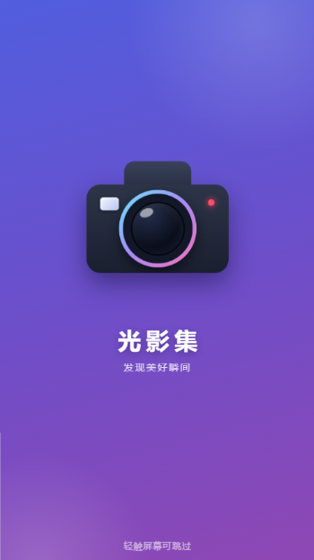
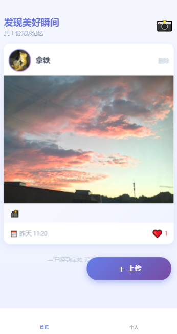
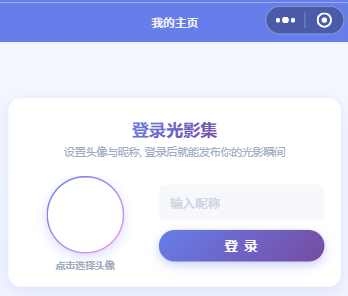
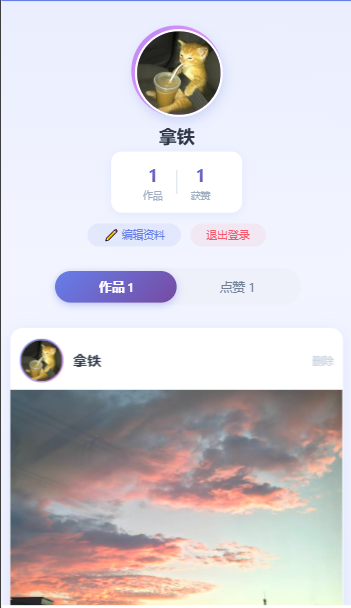
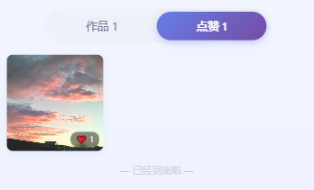
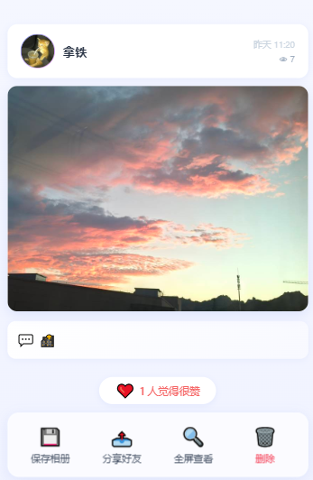
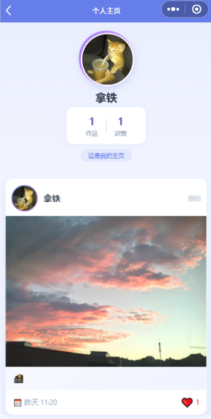

<center>姓名：沈卓娜  学号：24020007101</center>

| 姓名和学号？         | 沈卓娜，24020007101                                          |
| -------------------- | ------------------------------------------------------------ |
| 本实验属于哪门课程？ | 中国海洋大学26夏《移动软件开发》                             |
| 实验名称？           | 实验6：微信小程序云开发                                      |
| 博客地址？           | [移动软件开发_实验6：微信小程序云开发-CSDN博客](https://blog.csdn.net/natiedog/article/details/164747772?sharetype=blogdetail&sharerId=164747772&sharerefer=PC&sharesource=natiedog&spm=1011.2480.3001.8118) |
| 代码仓库地址？       | https://github.com/shen5920/Mobile-Software-Development/tree/main/lab6 |

## 一、实验内容

### 1.1 实验目的

1. 在官方"云开发 quickstart"模板的基础上，从零扩展出一个功能完整的**图片分享社区小程序**，实际使用云开发的三大能力：云数据库、云存储、云函数；
2. 理解云开发数据库的**权限模型**（集合权限、`_openid` 自动写入），掌握"读走客户端、写跨用户数据走云函数"的正确架构；
3. 掌握 `wx.cloud.database()` 增删改查、`wx.cloud.uploadFile` / `deleteFile`、`wx.cloud.callFunction`、`getTempFileURL` 等云开发 API 的用法；
4. 掌握云函数中 `wx-server-sdk` 的数据库指令（`_.inc`、`_.addToSet`、`_.pull`、`_.all`）与幂等更新技巧；
5. 综合运用小程序前端能力：底部 tabBar、开屏动画（CSS 时间轴 + 音效）、头像昵称填写能力（登录）、分页加载、相对时间显示等；
6. 培养排查云端问题的能力（云函数部署、环境 ID、集合权限等配置类问题的定位与解决）。

### 1.2 项目创建与目录结构

本实验基于微信云开发模板「云开发 quickstart」创建（新建项目 → 选择云开发模板 → 导入已有 AppID），在开发者工具中开通云环境后，将 `miniprogram/app.js` 中的环境 ID 替换为自己的云环境 ID，并在云开发控制台创建 `photos`（照片）、`comments`（评论）两个集合，权限均设为「所有用户可读，仅创建者可写」。最后在 `cloudfunctions/` 下部署 `getOpenid` 与 `interactPhoto` 两个云函数（右键 → 上传并部署：云端安装依赖）。

最终项目目录结构如下：

```
实验6/
├── README.md                  // 项目说明（部署步骤 / 字段说明 / 常见问题）
├── project.config.json        // 项目（工具）配置文件
├── screenshot.png             // 效果截图
├── cloudfunctions/            // 云函数目录
│   ├── getOpenid/             // 获取用户 openid（启动时自动调用）
│   └── interactPhoto/         // 照片互动：点赞/取消赞/浏览量/删除/统计/我的点赞
└── miniprogram/               // 小程序源码
    ├── app.js                 // 入口：云初始化 + openid 缓存重试 + 登录态管理
    ├── app.json               // 全局配置（页面、底部 tabBar、导航栏）
    ├── app.wxss               // 全局样式（卡片/骨架屏/空状态/字母头像等）
    ├── utils/
    │   └── util.js            // 通用工具（时间格式化、头像兜底、云函数封装、云端配置引导）
    ├── assets/
    │   ├── audio/shutter.wav  // 开屏快门音效（程序合成，包内播放）
    │   └── tab/               // tabBar 图标（home/me，灰/紫两态，代码生成）
    └── pages/
        ├── index/             // 首页 Tab：照片流（点赞/删除/下拉刷新/无限加载/开屏动画）
        ├── me/                // 个人 Tab：登录卡 + 我的主页（作品/点赞分段、退出登录）
        ├── homepage/          // "TA 的主页"（点头像/名字进入的他人主页，带参数）
        ├── detail/            // 照片详情（双击点赞、评论、浏览量、保存、分享、删除）
        └── add/               // 发布页（选图预览、描述、真实进度上传）
```

### 1.3 视图设计

#### 1.3.1 底部 tabBar 设计

「首页」与「个人」两个 Tab 使用微信原生 tabBar，图标为程序生成的房子 / 人形 PNG（灰 `#a0aec0`、选中紫 `#667eea` 两态）：

```json
"tabBar": {
  "color": "#a0aec0",
  "selectedColor": "#667eea",
  "backgroundColor": "#ffffff",
  "borderStyle": "white",
  "list": [
    { "pagePath": "pages/index/index", "text": "首页",
      "iconPath": "assets/tab/home.png", "selectedIconPath": "assets/tab/home-active.png" },
    { "pagePath": "pages/me/me", "text": "个人",
      "iconPath": "assets/tab/me.png", "selectedIconPath": "assets/tab/me-active.png" }
  ]
}
```

**解释：** 需要特别注意微信的限制——**tabBar 页面不能带参数跳转**，因此"我的主页"放在个人 Tab（无参数、展示当前用户），而浏览他人主页仍然使用独立的带参数页面 `pages/homepage/homepage`（点击首页卡片上的头像/昵称进入）。首页点击作者区域时做智能路由：点自己 → `wx.switchTab` 切到「个人」Tab；点别人 → `wx.navigateTo` 打开 TA 的主页。

#### 1.3.2 开屏动画设计（全屏）

冷启动时在首页之上盖一层全屏开屏：**相机弹出 → 红灯闪烁对焦 → 机身震动"咔嚓"（音效+震动）→ 屏幕白闪 → 白色淡出揭示首页**。开屏层由纯 CSS 绘制（无图片资源），相机机身、渐变光圈镜头、红色对焦灯均为 view + 渐变 + 阴影：

```xml
<view class="splash" wx:if="{{splashScene}}" catchtap="skipSplash" catchtouchmove="splashNoop">
  <view class="splash-deco deco-a"></view>
  <view class="splash-deco deco-b"></view>
  <view class="splash-stage">
    <view class="splash-cam">
      <view class="cam-shake">
        <view class="cam-hump"></view>
        <view class="cam-body">
          <view class="cam-flash"></view>
          <view class="cam-lens"><view class="cam-glass"></view></view>
          <view class="cam-light"></view>
        </view>
      </view>
    </view>
    <view class="splash-brand">
      <text class="brand-name">光影集</text>
      <text class="brand-slogan">发现美好瞬间</text>
    </view>
  </view>
  <view class="splash-skip-hint">轻触屏幕可跳过</view>
</view>
<!-- 白闪层独立于场景层：场景在全白时刻撤下，之后白层独自淡出，底下即真实首页 -->
<view class="flash-white" wx:if="{{splashOn}}"></view>
```

**解释（动画同步的巧妙之处）：** 所有元素（相机弹出、红灯闪烁、机身震动、白闪、淡出）共用**同一根 2400ms 的 CSS 动画时间轴**——各元素 keyframes 的百分比天然对齐，不会错拍；JS 只在两个时间点介入：约 1450ms 时播放快门音效并震动，约 1900ms 全白停顿中撤下"场景层"，此后**白闪层独立于场景层**逐渐淡出——白色底下已经是真实首页，实现"白色消失后小程序出现"的无缝衔接。动画期间调用 `wx.hideTabBar()` 隐藏底部 Tab（页面视口扩展为全屏），动画结束再 `wx.showTabBar()` 恢复。

#### 1.3.3 首页设计

首页为照片信息流：欢迎条 → 骨架屏 → 照片卡片列表 → 右下角悬浮上传按钮。每张卡片含作者区（头像/昵称，点击跳转主页）、照片（懒加载，点击进详情）、描述、相对时间与点赞区：

```xml
<view class="card fade-in-up">
  <view class="card-head">
    <view class="author-tap" bindtap="openProfile" data-id="{{item._openid}}"
          data-name="{{item.nickName}}" data-avatar="{{item.avatarUrl}}">
      <image wx:if="{{item.avatarUrl}}" class="avatar" src="{{item.avatarUrl}}" mode="aspectFill"></image>
      <view wx:else class="avatar letter-avatar" style="background:{{item.avatarBg}};">{{item.letter}}</view>
      <view class="title">
        <text class="nickName">{{item.nickName}}</text>
        <text class="address" wx:if="{{item.address}}">来自 {{item.address}}</text>
      </view>
    </view>
    <view class="delete-btn" wx:if="{{item._openid === openid}}" bindtap="deletePhoto"
          data-id="{{item._id}}" data-index="{{index}}"><text>删除</text></view>
  </view>
  <view class="card-body">
    <navigator url="{{item.detailUrl}}">
      <image src="{{item.photoUrl}}" mode="widthFix" lazy-load="{{true}}"></image>
    </navigator>
  </view>
  <view class="card-foot">
    <text class="date">{{item.displayTime}}</text>
    <view class="like-area" bindtap="toggleLike" data-id="{{item._id}}" data-index="{{index}}">
      <text class="like-btn">{{item.liked ? '❤️' : '🤍'}}</text>
      <text class="like-count">{{item.likes}}</text>
    </view>
  </view>
</view>
```

**解释：** 头像为空（或失效）时用**渐变字母头像**兜底（昵称首字 + 按昵称哈希取的配色，见 `utils/util.js`），不会出现裂图；作者资料（省份/国家）取不到时整行不渲染；删除按钮仅对自己的照片显示；列表支持下拉刷新、上拉触底无限加载。

#### 1.3.4 个人页设计（登录卡 + 我的主页）

个人 Tab 是登录入口与个人主页二合一：**未登录**时展示登录卡（使用微信官方"头像昵称填写能力"），**已登录**后展示个人主页（资料卡 + 作品/点赞分段 + 编辑资料/退出登录）：

```xml
<!-- 登录 / 编辑资料卡 -->
<view class="login-card" wx:if="{{!loggedIn || editing}}">
  <view class="login-head">
    <text class="login-title">{{editing ? '编辑资料' : '登录光影集'}}</text>
    <text class="login-sub">{{editing ? '修改头像或昵称后保存即可' : '设置头像与昵称, 登录后就能发布你的光影瞬间'}}</text>
  </view>
  <view class="login-body">
    <button class="avatar-pick" open-type="chooseAvatar" bindchooseavatar="onChooseAvatar">
      <image wx:if="{{avatarSrc}}" class="pick-avatar" src="{{avatarSrc}}" mode="aspectFill"></image>
      <view wx:else class="pick-avatar letter-avatar" style="background:{{loginBg}};">{{loginLetter}}</view>
      <text class="pick-hint">点击选择头像</text>
    </button>
    <view class="profile-fields">
      <input class="nick-input" type="nickname" placeholder="输入昵称" value="{{loginNick}}"
             bindinput="onNickInput" maxlength="20" />
      <button class="save-profile-btn" bindtap="saveProfile">{{editing ? '保存修改' : '登 录'}}</button>
    </view>
  </view>
</view>
<!-- 已登录：资料 + 分段 + 内容区 -->
<view class="seg-bar">
  <view class="seg-item {{activeTab === 'works' ? 'active' : ''}}" bindtap="switchTab" data-tab="works">作品 {{works}}</view>
  <view class="seg-item {{activeTab === 'likes' ? 'active' : ''}}" bindtap="switchTab" data-tab="likes">点赞 {{likedTotal}}</view>
</view>
```

**解释：** 登录=设置头像昵称（存本地缓存持久化）；**上传入口只放在首页**，未登录点上传会弹「请先登录」并一键跳转个人 Tab 登录；发布页因此不需要再内嵌资料设置。「我的作品」展示自己发布的大卡片（可删除）；「我的点赞」展示我赞过的全部照片缩略图墙（三列、右下角红心徽标，点图进详情）。

#### 1.3.5 发布页设计

发布页仅保留核心流程：已选图片预览（可点击大图预览、重新选择）→ 描述输入（100 字计数）→ 发布按钮 + 真实上传进度条 → 发布成功自动返回。页面下方是"我的作品"历史九宫格（缩略图带日期角标与删除按钮，支持加载更多）。

#### 1.3.6 详情页设计

详情页自上而下：作者栏（点击进入 TA 的主页；右侧显示发布时间与 👁 浏览量）→ 大图（**双击点赞**弹出爱心动画，长按弹出保存/全屏）→ 描述卡 → 点赞胶囊（❤️/🤍 + N 人觉得很赞）→ 毛玻璃操作栏（保存相册/分享好友/全屏查看，作者本人多一个红色删除）→ 评论区 → 底部固定评论输入条。分享支持好友与朋友圈，分享卡片图通过 `getTempFileURL` 将 `cloud://` fileID 换成 https 临时链接。

### 1.4 逻辑实现

#### 1.4.1 `app.js` —— 云初始化、openid 缓存与登录态

```js
App({
  globalData: { env: "cloud1-xxx", userInfo: null, openid: "" },
  onLaunch: function () {
    wx.cloud.init({ env: this.globalData.env, traceUser: true });
    // 从本地缓存恢复用户资料与 openid，冷启动立即可用
    ...
    this.ensureOpenid();
    if (this.globalData.openid) this.refreshOpenidSilently(); // 后台向云端校验一次
  },
  // 全局单例：所有页面可重复 await；带 3 次自动重试；成功后写缓存
  ensureOpenid: function () { ... },
  setUserProfile: function (profile) { ... },   // 登录：写 globalData + 缓存
  logout: function () { ... }                    // 退出：仅清头像昵称档案（保留 openid）
});
```

**解释：** openid 是后续"我点赞过哪些照片""我的作品"等查询的基础。它在启动时自动获取（不再依赖任何授权按钮），带自动重试并写入本地缓存；切微信号等场景下后台静默刷新纠正缓存。云函数调用连续失败时弹出一次"云端功能未就绪"引导（检查环境 ID、部署云函数、建集合），避免用户看到含义不明的"网络异常"。

#### 1.4.2 `interactPhoto` 云函数 —— 跨用户写操作唯一入口

由于集合权限为"仅创建者可写"，客户端**不能**修改他人照片文档（点赞、浏览、删除都会失败），因此这些操作全部收敛到云函数，以管理员身份执行，并用请求上下文 `OPENID` 识别用户：

```js
const cloud = require('wx-server-sdk');
cloud.init({ env: cloud.DYNAMIC_CURRENT_ENV });
const db = cloud.database();
const _ = db.command;
const photos = db.collection('photos');

// 点赞/取消赞：幂等（状态一致时直接返回当前值，不重复计数）
async function setLike(photoId, wantLike, openid) {
  const photo = await getPhoto(photoId);
  if (!photo) return { ok: false, msg: '照片不存在或已删除' };
  const liked = (photo.likedBy || []).indexOf(openid) >= 0;
  let likes = photo.likes || 0;
  if (liked === wantLike) return { ok: true, liked, likes };
  await photos.doc(photoId).update({
    data: wantLike
      ? { likes: _.inc(1), likedBy: _.addToSet(openid) }
      : { likes: _.inc(-1), likedBy: _.pull(openid) }
  });
  return { ok: true, liked: wantLike, likes: Math.max(0, likes + (wantLike ? 1 : -1)) };
}

exports.main = async (event) => {
  const { OPENID } = cloud.getWXContext();
  switch (event.action) {
    case 'like':  case 'unlike':  return await setLike(event.photoId, event.action === 'like', OPENID);
    case 'view':   /* views 浏览量 +1 */ break;
    case 'delete': /* 校验 _openid===OPENID 后：删记录 + 级联删评论 + 删云存储文件 */ break;
    case 'stat':   /* 分页聚合某用户的作品数与总获赞（突破客户端单次 20 条上限） */ break;
    case 'myLikes': /* 我的点赞：where({ likedBy: _.all([OPENID]) }) 服务端分页查询 */ break;
  }
};
```

**解释：** 删除动作同时清理三处（数据库记录、该照片的全部评论、云存储中的图片文件），保证不留孤儿数据；`myLikes` 动作让"我的点赞"列表在服务端查询——这很关键：客户端直查他人文档会受集合权限限制而整条查询失败。

#### 1.4.3 点赞交互 —— 乐观更新 + 服务端校准 + 失败回滚

```js
toggleLike: async function (e) {
  const item = this.data.photoList[index];
  const wantLike = !item.liked;
  // 1) 乐观更新：先让界面立刻响应
  this.patchItem(index, { liked: wantLike, likes: Math.max(0, item.likes + (wantLike ? 1 : -1)) });
  try {
    const r = await util.cloudFn('interactPhoto', { action: wantLike ? 'like' : 'unlike', photoId: id });
    if (r && r.ok) {
      this.patchItem(index, { liked: r.liked, likes: r.likes });  // 2) 服务端返回校准
    } else {
      this.patchItem(index, { liked: item.liked, likes: item.likes });  // 3) 失败回滚
    }
  } catch (err) { this.patchItem(index, { liked: item.liked, likes: item.likes }); }
}
```

**解释：** 点赞不需要客户端先"登录"——身份完全由云函数上下文识别；UI 先乐观更新保证手感，再以服务端返回的 `liked/likes` 校准（幂等设计天然防止并发双击造成计数漂移），失败则回滚并提示。

#### 1.4.4 列表分页与"原地同步"

客户端单次 `get` 最多返回 20 条，首页/我的作品/点赞墙均做了上拉加载更多（`skip + limit`）。返回列表页时若整页重刷会把用户拉回顶部，因此实现"原地同步"：拉取与已加载数量相当的最新数据，**按服务器顺序重建列表**（新发布自动插入最前、被删除的自动消失、点赞/浏览量原地刷新），深度之外多出的旧项保留在尾部——既不丢滚动位置，数据又保持最新。

#### 1.4.5 登录与退出

登录（个人页保存资料）时若选择了新头像，先把 `chooseAvatar` 返回的**临时路径上传到云存储**换取长期有效的 `cloud:// fileID` 再入库（临时路径当次会话后失效）；发布照片时昵称/头像取当前登录资料快照写入记录。退出登录仅清除头像昵称档案（`wx.removeStorageSync('userProfile')`），保留 openid——游客仍可浏览、点赞（服务端识别身份），只是不能发布。

#### 1.4.6 开屏动画的 JS 编排

```js
onLoad: function () { wx.hideTabBar({ animation: false }); },   // 全屏开屏
onReady: function () { this.startSplash(); },                   // 动画时间轴起点
startSplash: function () {
  // ...创建 InnerAudioContext，src 为包内 '/assets/audio/shutter.wav'
  this._splashTimer = setTimeout(() => { audio.play(); wx.vibrateShort({ type: 'light' }); }, 1450);
  this._splashTimer2 = setTimeout(() => this.setData({ splashScene: false }), 1900); // 全白时撤场景
  this._splashTimer3 = setTimeout(() => this.finishSplash(), 2500);
},
finishSplash: function () {
  // ...停止并销毁音频 → setData({ splashOn:false, splashScene:false }) → wx.showTabBar()
}
```

**解释：** 快门声 `shutter.wav` 是用 Python 合成的（第一声"咔"= 机械噪声点击 + 150Hz 机身共振，第二声"嚓"= 反光板回落，模拟真实快门双响），仅 15.9KB 打进代码包，双端原生支持 wav。所有定时器在跳过/卸载时统一清理并 `destroy()` 音频，避免泄漏。

### 1.5 运行效果

**开屏动画**

> 

冷启动全屏开屏：相机弹出、红灯闪烁对焦、品牌字"光影集"浮现（动画期间底部 tabBar 已隐藏，铺满全屏）。

> 

快门瞬间：机身微震 + "咔嚓"音效与震动，屏幕瞬间变白，白色缓缓淡出后揭示真实首页。

**首页**

> 

首页照片流：作者区（点头像/名字进主页）、照片、描述、相对时间、点赞；自己的照片有"删除"；右下角悬浮"＋ 上传"。

> 

未登录点击上传时弹出的「请先登录」引导（可一键跳转个人 Tab 登录）。

**个人页**

> 

个人 Tab 未登录状态：登录卡（选微信头像 + 输入昵称 → 登录）。

> 

登录后的我的主页：资料卡（编辑资料/退出登录）、作品数/获赞统计、「作品 / 点赞」分段、作品卡片列表。

> 

「我的点赞」缩略图墙：我赞过的所有照片，右下角红心徽标为点赞数，点图进详情可取消赞。

**发布页**

> 

发布页：选图后预览（点击可大图）、描述输入、上传真实进度条，下方"我的作品"历史九宫格。

**详情页**

> 

详情页：作者栏（时间 + 👁 浏览量）、大图（双击点赞弹爱心、长按保存/预览）、描述、点赞胶囊、操作栏与评论区。

> 

评论区：发布评论、删除自己的评论、底部固定输入条。

**TA 的主页**

> 

点击他人头像/名字进入的"TA 的主页"：资料 + 作品数/获赞统计 + 作品列表（带返回键的二级页面）。

### 1.6 扩展与完善

在云开发模板基础功能之上，本实验做了以下扩展：

1. **开屏动画**：纯 CSS 相机 + 统一 2.4s 时间轴 + 程序合成快门音效；白闪层与场景层分离实现"白色消失后才见首页"；动画期间自动隐藏底部 tabBar 铺满全屏，可点击跳过；
2. **底部导航**：新增"首页 / 个人"两个 Tab（含代码生成的图标），首页作者区智能路由：自己→切 Tab，他人→进 TA 主页（tabBar 页不能带参，故 TA 主页保留为独立参数页面）；
3. **登录体系**：废弃的 `getUserInfo` 改为官方"头像昵称填写能力"，头像转存云存储防临时路径失效；登录/编辑资料/退出登录完整闭环；未登录不能发布（首页上传按钮做拦截引导）；
4. **我的主页 + 我的点赞**：个人页"作品/点赞"双分段；点赞墙通过云函数 `myLikes` 查询（不受集合权限影响），含分页、实时计数、原地同步；
5. **云函数统一互动入口**：点赞（幂等、防并发漂移）、浏览量、删除（记录+评论+云文件级联清理）、主页统计聚合、我的点赞，全部以服务端身份执行，规避集合权限限制；
6. **评论系统**：评论发布/删除（删除照片时云函数级联清理评论），详情页固定输入条；
7. **上传体验**：`wx.chooseMedia` + 选图预览 + 真实上传进度（`onProgressUpdate`）+ 按用户分目录的云存储路径 + 发布成功自动返回；
8. **列表体验**：下拉刷新、上拉无限加载、图片懒加载、"已经到底啦"状态、返回列表页"原地同步"（不丢滚动位置且数据最新）；
9. **时间与头像**：相对时间（今天 14:30 / 昨天 / M月D日）、`createTime` 时间戳排序（修复同日字符串排序乱序）、字母头像兜底、头像空/失效不裂图；
10. **详情与分享**：双击点赞爱心动画、长按保存/全屏、浏览量统计、分享好友+朋友圈（分享图 https 化）；
11. **健壮性**：openid 自动获取（缓存+重试+后台校验）、云端配置失败时给出明确引导弹窗、失败操作回滚、`safeExt` 等空值防御、定时器与音频资源释放；
12. **README 部署文档**：环境 ID、集合创建与权限、云函数部署、字段说明、常见问题排查，保证实验可复现。

## 二、问题总结与体会

**遇到的问题及解决：**

1. **登录接口已废弃，拿不到真实头像昵称**：项目最初沿用旧模板的 `open-type="getUserInfo"` + `wx.getUserInfo`，但微信自 2022 年起该能力已不再弹授权框，返回的只有灰头像和"微信用户"；并且原逻辑把 openid 获取也绑在这次"授权"上，导致点赞、发布等功能全部依赖一个失效按钮。解决方法是改用官方推荐的**头像昵称填写能力**（`button open-type="chooseAvatar"` + `input type="nickname"`）作为登录入口，openid 改为 `App.onLaunch` 启动即自动获取；同时发现 `chooseAvatar` 返回的是**临时路径**，重启即失效，于是把头像先上传到云存储换成长效 `cloud:// fileID` 再入库。

2. **点赞"谁都点不了"——客户端改他人文档被权限拒绝**：最初点赞用 `wx.cloud.database()` 直接在客户端 `update` 他人照片，而集合默认权限是"仅创建者可读写"，非作者更新必然失败（只有作者能给自己点赞），这在模拟器里表现为点击无反应。解决方法是理解云开发权限模型后重构：**读可以走客户端，跨用户写必须走云函数**。新建 `interactPhoto` 云函数统一处理点赞/取消赞/浏览量/删除，身份取请求上下文 `OPENID`，并用 `_.inc` + `_.addToSet/_pull` 原子更新；函数设计成幂等（重复请求不重复计数），配合前端"乐观更新 + 服务端返回值校准 + 失败回滚"，双击连点也不会把计数加乱。

3. **"保存资料/发布/点赞"全部提示错误**：现象是点什么都提示"保存失败""网络异常，请稍后再试"。逐层排查后发现根因不是代码逻辑：新加的云函数没有部署到云端、`app.js` 里的环境 ID 与云开发控制台不一致，导致 `getOpenid` 调用失败、openid 为空，前端所有依赖 openid 的功能全部被静默拦下。解决分两层：代码层把 openid 获取做成"3 次自动重试 + 本地缓存 + 后台静默校验"，点赞等本不需要客户端 openid 的逻辑去掉多余门槛（身份交给服务端），失败时统一弹"云端功能未就绪"引导弹窗（列出环境 ID/部署/建集合三条检查项），不再显示含义不明的错误；使用层则梳理出部署清单写进 README。

4. **"我的点赞"一片空白，还没有任何报错**：点赞数明明增加了，个人页点赞墙却查不到。原因是点赞墙最初由客户端直查 `photos` 集合中 `likedBy` 包含我的记录——这需要读取**别人**的照片文档，一旦集合权限不是"所有用户可读"，整条查询被拒绝；而代码里把这次失败静默吞掉了，界面只剩空白。解决方法是把查询移入云函数新增的 `myLikes` 动作（服务端以管理员身份查询，天然不受集合权限限制），同时把失败路径改为可见提示；这也说明**云开发里"静默失败"比报错更危险**，所有异步操作都要有明确的成功/失败出口。

5. **tabBar 页面不能带参数跳转**：做"点自己头像进个人主页"时发现，若把带参数的主页页直接放进 tabBar，`wx.navigateTo` 会报错。解决方法是拆成两个页面：个人 Tab 的 `me` 页（无参、取当前用户）+ 保留参数版 `homepage` 页（他人主页），首页点击作者时先比较 openid——是自己就 `switchTab` 到个人 Tab，是别人才 `navigateTo` 打开 TA 的主页，用户体感上是"同一个主页"。

6. **返回列表页后状态是旧的**：从详情页点赞/取消赞、或发布新照片后返回首页，如果整页重刷会把用户拉回顶部，不重刷又看不到最新状态。最终实现"原地同步"算法：按已加载数量向后端拉取同等深度的最新数据，按服务器顺序**重建合并**列表（新发布的自然插入最前、被删的自然消失、赞数原地更新），只把超出深度的少量旧项保留在尾部——既不打断阅读位置，数据又是准的。

**收获与体会：**

通过本次实验，我第一次完整走通了"前端小程序 + 云数据库 + 云存储 + 云函数"的全栈开发流程。相比前几个实验的纯前端项目，云开发带来的最大不同是**必须时刻清楚数据"从哪里读、由谁写"**：集合权限模型决定了客户端只能改自己的文档，跨用户的点赞、删除、统计就必须交给云函数；而云函数里的身份不再依赖前端传参，直接取 `OPENID` 上下文，天然防伪造。想清楚这条"读客户端、写服务端"的边界之后，权限报错、点赞失败这类问题就都能解释和避免了。

另一个重要体会是**服务端要设计成幂等的**。点赞这种高频操作，如果前端多发一次请求计数就会翻倍；把"先查状态、状态一致就直接返回"写进云函数，再配合前端的乐观更新与服务端校准，才保证了极端情况（双击、断网重试）下数据依然一致。这与实验四推箱子中"用求解器验证数据、而不是凭感觉"的教训一脉相承——**数据的正确性要靠机制保证，而不是靠运气**。

最后，云开发的"配置类问题"（环境 ID 不一致、云函数未部署、集合没建、权限没改）比代码问题更难发现——它们不报语法错误，只是让功能悄悄失效。这次我把部署清单、字段说明和常见问题都写进了 README，并在小程序内做了"云端未就绪"的引导弹窗，把"踩过的坑"沉淀成可复现的步骤，这也是工程上比"把功能调通"更进一步的收获。
